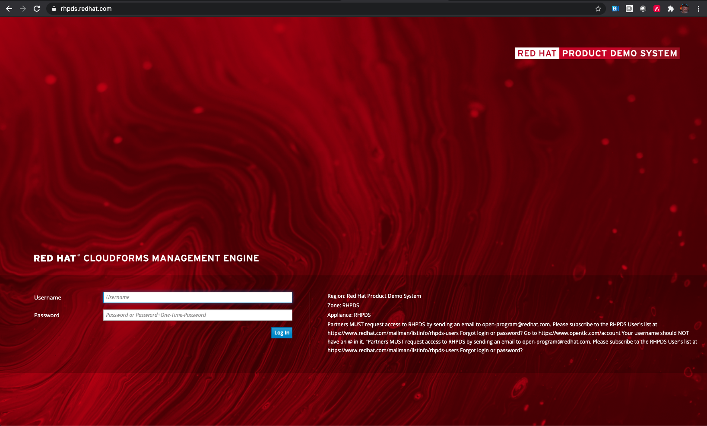
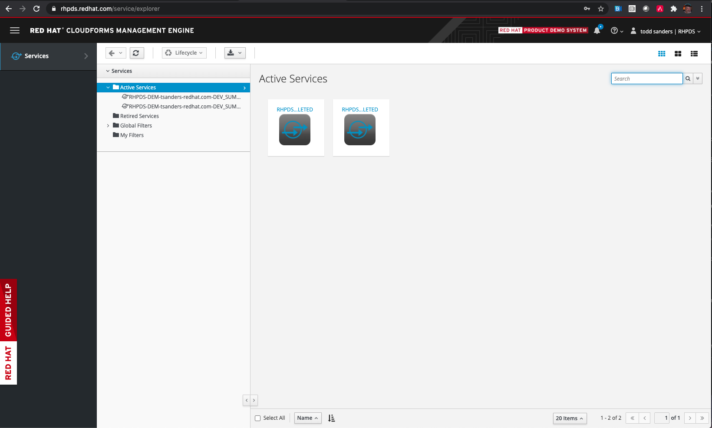
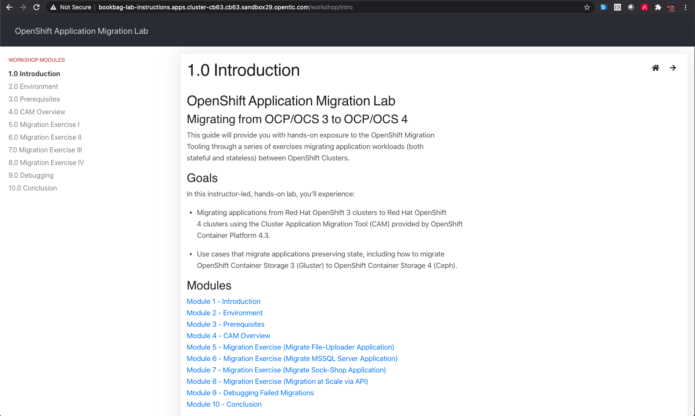

# OpenShift Cluster Application Migration Tool Lab

This guide will provide you with hands-on exposure to the new OpenShift Migration Tooling through a series of labs migrating application workloads (both stateful and stateless) between OpenShift Clusters.

## Description

Migrates application workloads from Cluster A to Cluster B (includes ui, controller, Velero/Restic, plugins, etc). This application is available for installation through the Operator Hub/OLM. This course requires both the CAM OCP3 and OCP4 services from RHPDS.

## Goals

* Migrate several application workloads (both stateful and stateless) from an OpenShift 3.11 cluster to an OpenShift 4.x cluster using the Cluster Application Migration Tool (CAM)
* Utilize the Control Plane Migration Assistance Tool (CPMA) to generate a detailed report identifying areas of custom configuration that need to be considered as part of application migration planning.

## Setup Steps

Step 1: Step 1: Browse to RHPDS: https://rhpds.redhat.com



Step 2: Login with your RHPDS username/password.

Step 3: Browse to Services >> Catalogs and open the “Workshops” catalog.

Step 4: Order two services as follows:

* Cluster Application Migration tool (CAM) - OCP3 Cluster
* Cluster Application Migration tool (CAM) - OCP4 Cluster

Step 5: Wait for both services to become available.  ```This will take ~45 min.```



Step 6: Open a terminal window with two tabs.  One tab for the source OCP3 cluster and one tab for the destination OCP4 cluster.

Step 7: In the OCP3 tab, ssh into the OCP3 bastion host using the information provided in RHPDS for the provisioned service.

```bash
$ ssh tsanders-redhat.com@bastion.clayton-a831.example.opentlc.com
The authenticity of host 'bastion.clayton-a831.example.opentlc.com (54.196.40.213)' can't be established.
ECDSA key fingerprint is SHA256:GmGLppSGEshB6jBVODuMnAQrZhOVUTnflNZV4WIfn+E.
Are you sure you want to continue connecting (yes/no/[fingerprint])? yes
Warning: Permanently added 'bastion.clayton-a831.example.opentlc.com,54.196.40.213' (ECDSA) to the list of known hosts.
tsanders-redhat.com@bastion.clayton-a831.example.opentlc.com's password:
```
In the home directory, locate the cluster.info file.

Step 8: In the OCP4 tab, ssh into the OCP4 bastion host using the information provided in RHPDS for the provisioned service.

```bash
$ ssh tsanders-redhat.com@bastion.cb63.sandbox29.opentlc.com
The authenticity of host 'bastion.cb63.sandbox29.opentlc.com (3.129.226.158)' can't be established.
ECDSA key fingerprint is SHA256:gdbFAdYsUuHApojZSmYiP5wulCBv/ZoZlT1PKtmNBEE.
Are you sure you want to continue connecting (yes/no/[fingerprint])? yes
Warning: Permanently added 'bastion.cb63.sandbox29.opentlc.com,3.129.226.158' (ECDSA) to the list of known hosts.
tsanders-redhat.com@bastion.cb63.sandbox29.opentlc.com's password:
```

Step 9: In the home directory, locate the cluster.info file.  Edit the cluster.info file in the home directory adding in the OCP3 cluster.info information and save the file.

```
[OCP3]
guid=clayton-a831
domain=.example.opentlc.com
student_name=tsanders-redhat.com

[OCP4]
guid=cb63
domain=.sandbox29.opentlc.com
student_name=tsanders-redhat.com
```

Step 10:  In the OCP4 terminal tab, oc login to the OCP4 cluster using the information provided by RHPDS:

```bash
$ oc login https://api.cluster-cb63.cb63.sandbox29.opentlc.com:6443 -u admin -p r3dh4t1!
The server uses a certificate signed by an unknown authority.
You can bypass the certificate check, but any data you send to the server could be intercepted by others.
Use insecure connections? (y/n): y

Login successful.

You have access to 55 projects, the list has been suppressed. You can list all projects with 'oc projects'

Using project "default".
Welcome! See 'oc help' to get started.
```

Step 11: In the OCP4 terminal tab , run the bookbag.yaml ansible playbook (also found in the home directory) to auto-generate the Lab documentation.

```
$ ansible-playbook bookbag.yml -e ocp3_password=r3dh4t1! -e ocp4_password=r3dh4t1!
[WARNING]: provided hosts list is empty, only localhost is available. Note that the implicit localhost does not match 'all'


PLAY [localhost] *************************************************************************************************************************************************************************************

TASK [Gathering Facts] *******************************************************************************************************************************************************************************
ok: [localhost]

TASK [fail] ******************************************************************************************************************************************************************************************
skipping: [localhost]

TASK [Reading cluster information file] **************************************************************************************************************************************************************
ok: [localhost]

TASK [Creating bookbag project] **********************************************************************************************************************************************************************
changed: [localhost]

TASK [set_fact] **************************************************************************************************************************************************************************************
ok: [localhost]

TASK [Fetching bookbag repo] *************************************************************************************************************************************************************************
changed: [localhost]

TASK [Building bookbag image] ************************************************************************************************************************************************************************
changed: [localhost] => (item=oc project lab-instructions)
changed: [localhost] => (item=oc process -f build-template.yaml -p GIT_REPO='https://gitlab.com/2020-summit-labs/openshift-migration-lab-bookbag.git' | oc apply -f -)
changed: [localhost] => (item=oc start-build bookbag --follow)

TASK [Deploying bookbag image] ***********************************************************************************************************************************************************************
changed: [localhost]

TASK [Read bookbag route] ****************************************************************************************************************************************************************************
changed: [localhost]

TASK [debug] *****************************************************************************************************************************************************************************************
ok: [localhost] => {
    "msg": "Route to bookbag : bookbag-lab-instructions.apps.cluster-cb63.cb63.sandbox29.opentlc.com"
}

PLAY RECAP *******************************************************************************************************************************************************************************************
localhost                  : ok=9    changed=5    unreachable=0    failed=0    skipped=1    rescued=0    ignored=0   
```

Step 12: Launch the auto-generated bookbag documentation by browsing to the supplied route:



Step 13. Proceed with Lab by following steps outlined in bookbag documentation.
