:sectlinks:
:markup-in-source: verbatim,attributes,quotes
:OCP3_GUID: %ocp3_guid%
:OCP3_DOMAIN: %ocp3_domain%
:OCP3_SSH_USER: %ocp3_ssh_user%
:OCP3_PASSWORD: %ocp3_password%
:OCP4_GUID: %ocp4_guid%
:OCP4_DOMAIN: %ocp4_domain%
:OCP4_SSH_USER: %ocp4_ssh_user%
:OCP4_PASSWORD: %ocp4_password%
:OCP3_BASTION: %ocp3_bastion%
:OCP4_BASTION: %ocp4_bastion%

== Introduction

Migration hooks provide a means for running custom code at points in the migration to handle logic unique to a migration.
This may include scenarios where custom quiesce logic is desired, manual data migration of unsupported types is needed, or to handle application repair after it has been migrated to a new environment.

There are two primary methods of creating a hook.
The first is to write an Ansible playbook that is run either on an image we provide or one you create with additional ansibile modules or tools that you require.
The other is to create a custom hook container and the entrypoint will be executed.

There are currently 4 phases within a migration where migration hooks can be run.
One hook may be run per phase for a maximum total of 4 hooks per migration, and hooks in any phase may be run either on the source or destination cluster.

The phases where hooks may be run are:

 * *PreBackup*: Before any task is performed.
 * *PostBackup*: After backup tasks are complete.
 * *PreRestore*: Before restore tasks are performed.
 * *PostRestore*: After restore tasks are complete.

=== Default hook image

The default hook image is `quay.io/konveyor/hook-runner:latest`.
It is based off of the Ansible Runner image with the addition of python-openshift to provided Ansible k8s resources as well as a recent oc binary.

=== Hook execution

When an Ansible playbook is provided as part of a migration hook it will be mounted into the hook container as a ConfigMap.
In either case the hook container will be run as a job on the desired cluster, using the execution ServiceAccount and Namespace specified.
Jobs are designed to run to completion, even if the initial pod is evicted or killed, and may attempt to run several times up until it it either reaches the backoffLimit or successful completion.
We use the default backoffLimit of 6 for hook jobs.

=== Exercise
In this exercise, we will be using Migration Hooks to address a MediaWiki configuration setting change (https://www.mediawiki.org/wiki/Manual:$wgServer[$wgServer]) that needs to be updated to the destination OCP 4 cluster post application migration.
Let's get started.

MediaWiki is running on your source OCP 3 cluster in the `mediawiki` namespace.

Let's launch the MTC UI and create a Migration Plan with a Hook:

. From the `Migration plans` tab, click the `Add migration plan` button:
Give your plan a name, select the source and destination clusters, and your replication repository.
Then click Next.
+
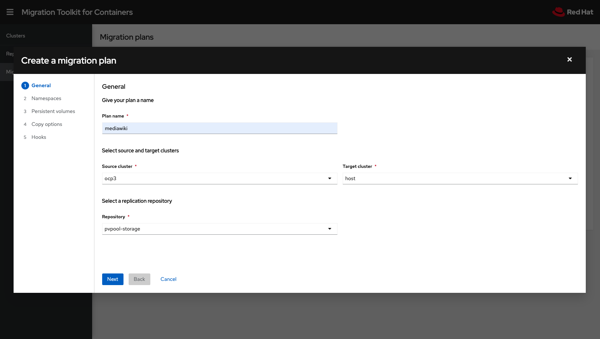
+
. Select the `mediawiki` namespace/project, and click Next.
+
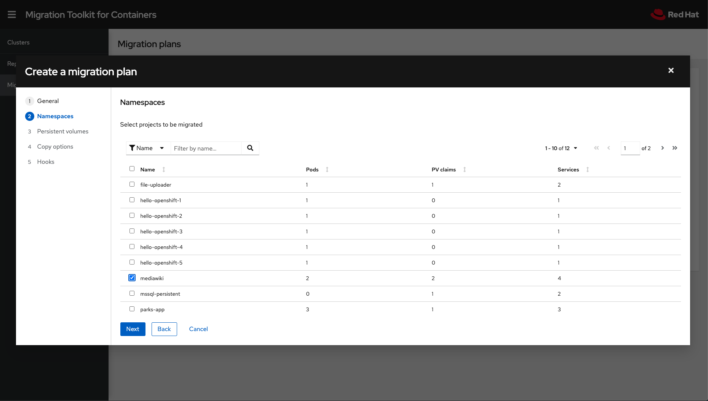
+
. Now we are displayed the OCS3/Gluster persistent volumes associated with our application.
For this example, since we are migrating our storage from Gluster to Ceph, let’s choose `Copy` as our transfer type.
Click Next.
+
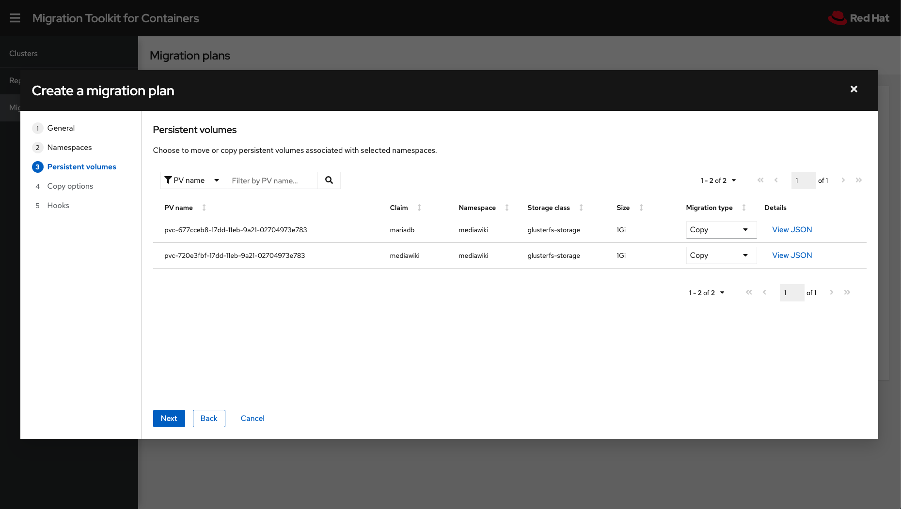
+
. Next, we will need to select the `copy method` and `target storage class`.
MTC will attempt to pre-select these for you as defaults.
In our case, we want *Filesystem copy* and *ocs-storagecluster-ceph-rbd*.
Click Next.
+
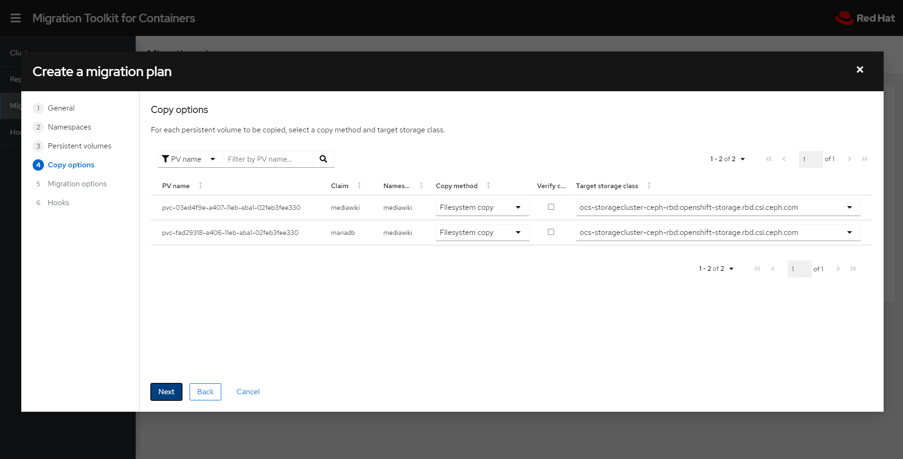
+
. We are now presented with Migration Options.
Click Next.
+
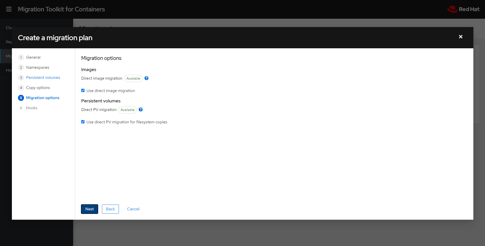
+
. Here is where we add our Migration Hook.
Let's click the `Add Hook` button.
+
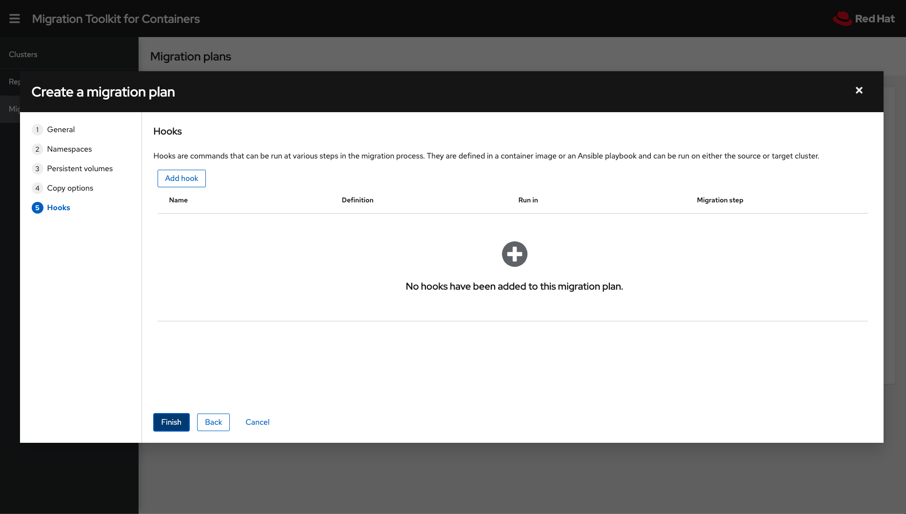
+
. We are making a new hook, so choose "Create a new hook" from the drop-down menu.
Let's give our hook a `name`, and to start the `Hook definition`, let's paste in the ansible playbook below:
+
[source,yaml]
----
- hosts: localhost
  gather_facts: false
  tasks:
  - name: "Get mediawiki pod"
    shell: "oc get po -n mediawiki -l app=mediawiki --no-headers -o custom-columns='name:.metadata.name'"
    register: pod_name

  - name: "Get current wgServer value"
    shell: "oc exec -n mediawiki {{ pod_name.stdout }} -- grep -i wgServer /persistent/LocalSettings.php | awk -F '\"' '{ print $(NF-1) }'"
    register: old_wgserver

  - name: "Print current value"
    debug:
      msg: "The old wgServer value is: {{ old_wgserver.stdout }}"

  - name: "Get new route address"
    shell: "oc get route -n mediawiki -l app=mediawiki --no-headers -o custom-columns='host:.spec.host'"
    register: route_host

  - name: "Print new route hostname"
    debug:
      msg: "The new route hostname is {{ route_host.stdout }}"

  - name: "Replace wgServer value"
    shell: "oc exec -n mediawiki {{ pod_name.stdout }} -- sed -i 's,^$wgServer.*,$wgServer = \"http://{{ route_host.stdout }}\";,g' /persistent/LocalSettings.php"

  - name: "Get current wgServer value"
    shell: "oc exec -n mediawiki {{ pod_name.stdout }} -- grep -i wgServer /persistent/LocalSettings.php | awk -F '\"' '{ print $(NF-1) }'"
    register: new_wgserver

  - name: "Print current value"
    debug:
      msg: "The new wgServer value is: {{ new_wgserver.stdout }}"

  - name: "Restart mediawiki"
    shell: "oc delete po -n mediawiki -l app=mediawiki"
----
+
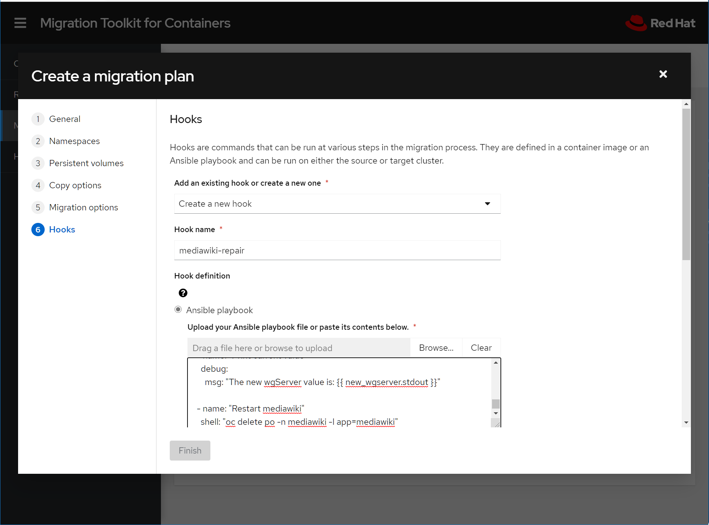
+
. Now scroll down, and let's finish the Hook definition.
We want our hook to repair the MediaWiki application on the OCP4 cluster, so let's select:
+
* Run in: Check *Target Cluster*. This is where ansible playbook will run.
* Service account name: *migration-controller*
* Service account namespace: *openshift-migration*
+
. Lastly, we have to choose which phase to run the hook.
Let's select *PostRestore*.
That's it for the Hook definition, so click `Add hook`.
+
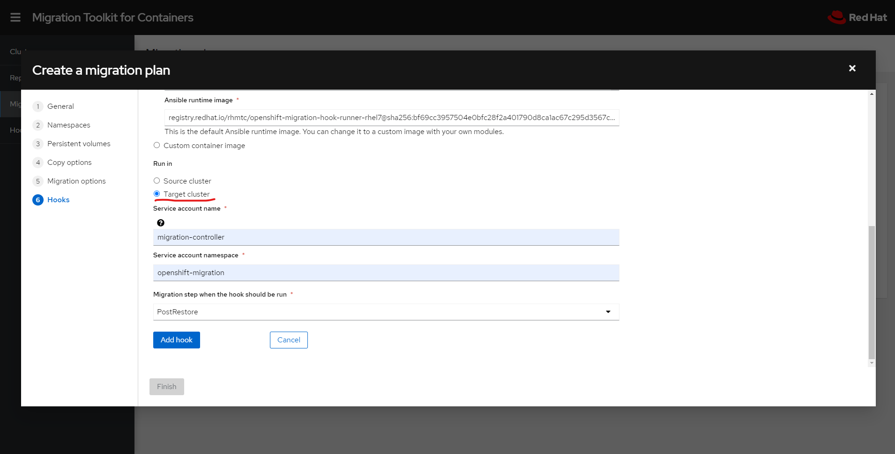
+
Click `Finish` to save the plan. And then click on 'Close'.
+
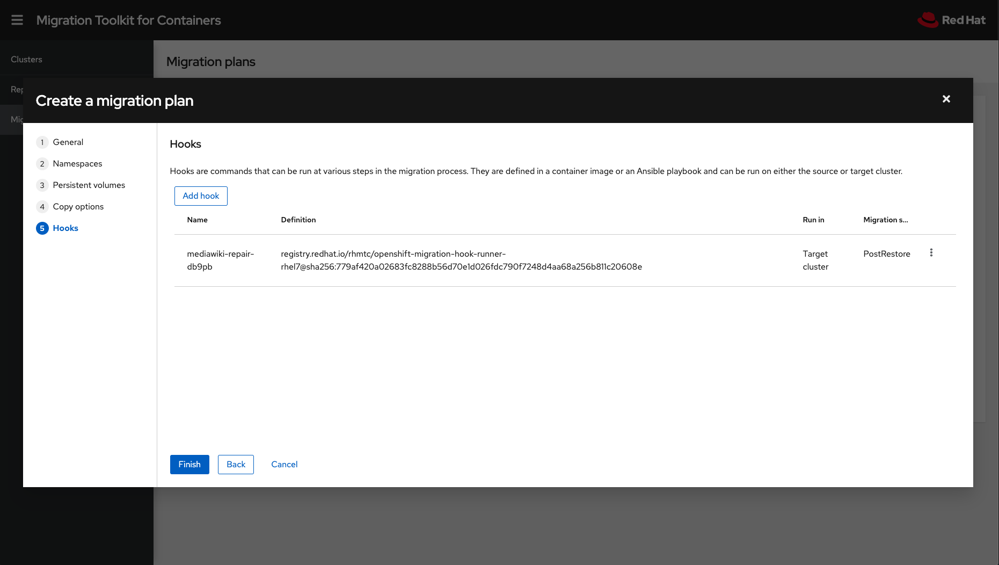

==== A Closer Look at the Resources

Let's take a closer look at the mighook resource that was created during creation of the Migration Plan.

. On our OCP 4 cluster, let's change to the project `openshift-migration` 
+
[source,sh]
----
$ oc project openshift-migration
----
+
.Sample Output
[source,textinfo]
----
Now using project "openshift-migration" on server ...
----
+
. Now run the following to examine the Migration Hook
+
[source,sh]
----
oc get mighook -o yaml
----
+
.Sample Output
[source,yaml]
----
apiVersion: migration.openshift.io/v1alpha1
kind: MigHook
metadata:
  creationTimestamp: "2020-10-28T18:44:56Z"
  generateName: mediawiki-repair-
  generation: 3
  name: mediawiki-repair-db9pb
  namespace: openshift-migration
  resourceVersion: "275787"
  selfLink: /apis/migration.openshift.io/v1alpha1/namespaces/openshift-migration/mighooks/mediawiki-repair-db9pb
  uid: 924ca391-0af7-4842-8581-2f945ae6de43
spec:
  custom: false
  image: registry.redhat.io/rhmtc/openshift-migration-hook-runner-rhel7@sha256:779af420a02683fc8288b56d70e1d026fdc790f7248d4aa68a256b811c20608e
  playbook: LSBob3N0czogbG9jYWxob3N0CiAgZ2F0aGVyX2ZhY3RzOiBmYWxzZQogIHRhc2tzOgogIC0gbmFtZTogIkdldCBtZWRpYXdpa2kgcG9kIgogICAgc2hlbGw6ICJvYyBnZXQgcG8gLW4gbWVkaWF3aWtpIC1sIGFwcD1tZWRpYXdpa2kgLS1uby1oZWFkZXJzIC1vIGN1c3RvbS1jb2x1bW5zPSduYW1lOi5tZXRhZGF0YS5uYW1lJyIKICAgIHJlZ2lzdGVyOiBwb2RfbmFtZQoKICAtIG5hbWU6ICJHZXQgY3VycmVudCB3Z1NlcnZlciB2YWx1ZSIKICAgIHNoZWxsOiAib2MgZXhlYyAtbiBtZWRpYXdpa2kge3sgcG9kX25hbWUuc3Rkb3V0IH19IC0tIGdyZXAgLWkgd2dTZXJ2ZXIgL3BlcnNpc3RlbnQvTG9jYWxTZXR0aW5ncy5waHAgfCBhd2sgLUYgJ1wiJyAneyBwcmludCAkKE5GLTEpIH0nIgogICAgcmVnaXN0ZXI6IG9sZF93Z3NlcnZlcgoKICAtIG5hbWU6ICJQcmludCBjdXJyZW50IHZhbHVlIgogICAgZGVidWc6CiAgICAgIG1zZzogIlRoZSBvbGQgd2dTZXJ2ZXIgdmFsdWUgaXM6IHt7IG9sZF93Z3NlcnZlci5zdGRvdXQgfX0iCgogIC0gbmFtZTogIkdldCBuZXcgcm91dGUgYWRkcmVzcyIKICAgIHNoZWxsOiAib2MgZ2V0IHJvdXRlIC1uIG1lZGlhd2lraSAtbCBhcHA9bWVkaWF3aWtpIC0tbm8taGVhZGVycyAtbyBjdXN0b20tY29sdW1ucz0naG9zdDouc3BlYy5ob3N0JyIKICAgIHJlZ2lzdGVyOiByb3V0ZV9ob3N0CgogIC0gbmFtZTogIlByaW50IG5ldyByb3V0ZSBob3N0bmFtZSIKICAgIGRlYnVnOgogICAgICBtc2c6ICJUaGUgbmV3IHJvdXRlIGhvc3RuYW1lIGlzIHt7IHJvdXRlX2hvc3Quc3Rkb3V0IH19IgoKICAtIG5hbWU6ICJSZXBsYWNlIHdnU2VydmVyIHZhbHVlIgogICAgc2hlbGw6ICJvYyBleGVjIC1uIG1lZGlhd2lraSB7eyBwb2RfbmFtZS5zdGRvdXQgfX0gLS0gc2VkIC1pICdzLF4kd2dTZXJ2ZXIuKiwkd2dTZXJ2ZXIgPSBcImh0dHA6Ly97eyByb3V0ZV9ob3N0LnN0ZG91dCB9fVwiOyxnJyAvcGVyc2lzdGVudC9Mb2NhbFNldHRpbmdzLnBocCIKCiAgLSBuYW1lOiAiR2V0IGN1cnJlbnQgd2dTZXJ2ZXIgdmFsdWUiCiAgICBzaGVsbDogIm9jIGV4ZWMgLW4gbWVkaWF3aWtpIHt7IHBvZF9uYW1lLnN0ZG91dCB9fSAtLSBncmVwIC1pIHdnU2VydmVyIC9wZXJzaXN0ZW50L0xvY2FsU2V0dGluZ3MucGhwIHwgYXdrIC1GICdcIicgJ3sgcHJpbnQgJChORi0xKSB9JyIKICAgIHJlZ2lzdGVyOiBuZXdfd2dzZXJ2ZXIKCiAgLSBuYW1lOiAiUHJpbnQgY3VycmVudCB2YWx1ZSIKICAgIGRlYnVnOgogICAgICBtc2c6ICJUaGUgbmV3IHdnU2VydmVyIHZhbHVlIGlzOiB7eyBuZXdfd2dzZXJ2ZXIuc3Rkb3V0IH19IgoKICAtIG5hbWU6ICJSZXN0YXJ0IG1lZGlhd2lraSIKICAgIHNoZWxsOiAib2MgZGVsZXRlIHBvIC1uIG1lZGlhd2lraSAtbCBhcHA9bWVkaWF3aWtpIg==
  targetCluster: destination
status:
  conditions:
  - category: Required
    lastTransitionTime: "2020-10-28T18:44:56Z"
    message: The hook is ready.
    status: "True"
    type: Ready
  observedGeneration: 3
----
+
As you can see, our hook name has had a token postpended to ensure uniqueness.
The playbook has been base-64 encoded, and the hook has been validated and is ready for use with our plan.
+
.  Let's also take a look at the mediawiki migration plan:
+
[source,sh]
----
oc get migplan mediawiki -o yaml
----
+
.Sample Output
+
[source,yaml]
----
apiVersion: migration.openshift.io/v1alpha1
kind: MigPlan
metadata:
  annotations:
    openshift.io/touch: 7af0d6b2-19f0-11eb-98e6-0a580a800209
  creationTimestamp: "2020-10-28T18:38:26Z"
  generation: 11
  name: mediawiki
  namespace: openshift-migration
  resourceVersion: "325885"
  selfLink: /apis/migration.openshift.io/v1alpha1/namespaces/openshift-migration/migplans/mediawiki
  uid: 46734b84-8fd9-405d-bae3-5b00f9128a5a
spec:
  destMigClusterRef:
    name: host
    namespace: openshift-migration
  hooks:
  - executionNamespace: openshift-migration
    phase: PostRestore
    reference:
      name: mediawiki-repair-db9pb
      namespace: openshift-migration
    serviceAccount: migration-controller
  migStorageRef:
    name: pvpool-storage
    namespace: openshift-migration
  namespaces:
  - mediawiki
  persistentVolumes:
  - capacity: 1Gi
    name: pvc-677cceb8-17dd-11eb-9a21-02704973e783
    pvc:
      accessModes:
      - ReadWriteOnce
      hasReference: true
      name: mariadb
      namespace: mediawiki
    selection:
      action: copy
      copyMethod: filesystem
      storageClass: ocs-storagecluster-ceph-rbd
    storageClass: glusterfs-storage
    supported:
      actions:
      - copy
      - move
      copyMethods:
      - filesystem
      - snapshot
  - capacity: 1Gi
    name: pvc-720e3fbf-17dd-11eb-9a21-02704973e783
    pvc:
      accessModes:
      - ReadWriteOnce
      hasReference: true
      name: mediawiki
      namespace: mediawiki
    selection:
      action: copy
      copyMethod: filesystem
      storageClass: ocs-storagecluster-ceph-rbd
    storageClass: glusterfs-storage
    supported:
      actions:
      - copy
      - move
      copyMethods:
      - filesystem
      - snapshot
  srcMigClusterRef:
    name: ocp3
    namespace: openshift-migration
status:
  conditions:
  - category: Required
    lastTransitionTime: "2020-10-28T18:38:27Z"
    message: The `persistentVolumes` list has been updated with discovered PVs.
    reason: Done
    status: "True"
    type: PvsDiscovered
  - category: Required
    lastTransitionTime: "2020-10-28T18:38:27Z"
    message: The storage resources have been created.
    status: "True"
    type: StorageEnsured
  - category: Required
    lastTransitionTime: "2020-10-28T18:38:28Z"
    message: The migration registry resources have been created.
    status: "True"
    type: RegistriesEnsured
  - category: Advisory
    lastTransitionTime: "2020-10-28T18:45:58Z"
    message: Limited validation; PV discovery and resource reconciliation suspended.
    status: "True"
    type: Suspended
  - category: Required
    lastTransitionTime: "2020-10-29T12:32:21Z"
    message: The migration plan is ready.
    status: "True"
    type: Ready
  excludedResources:
  - imagetags
  - templateinstances
  - clusterserviceversions
  - packagemanifests
  - subscriptions
  - servicebrokers
  - servicebindings
  - serviceclasses
  - serviceinstances
  - serviceplans
  - operatorgroups
  - events
  observedDigest: 6491949d7ac842b67111abd48f06ed0416052dcbec8ca208282af2a7c1ddbbf3
----
+
In this section from the above output, you can see our hook is properly associated:
+
[source,yaml]
----
hooks:
  - executionNamespace: openshift-migration
    phase: PostRestore
    reference:
      name: mediawiki-repair-db9pb
      namespace: openshift-migration
    serviceAccount: migration-controller
----
+
. Now let's kick off a migration.
Select Migration Plan "mediawiki" for "Migration" by clicking the control menu at the right of the entry, and then confirming.
+
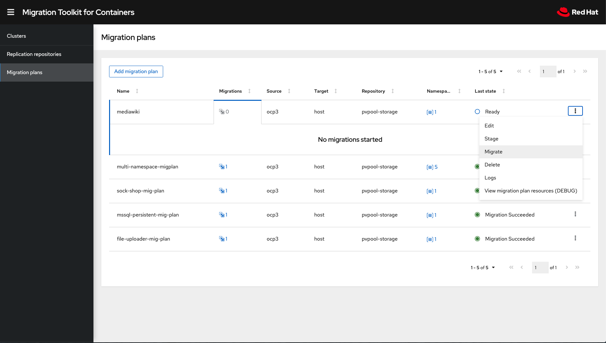
+
. Click the Migrations indicator for the mediawiki migration plan and observe the process.
+
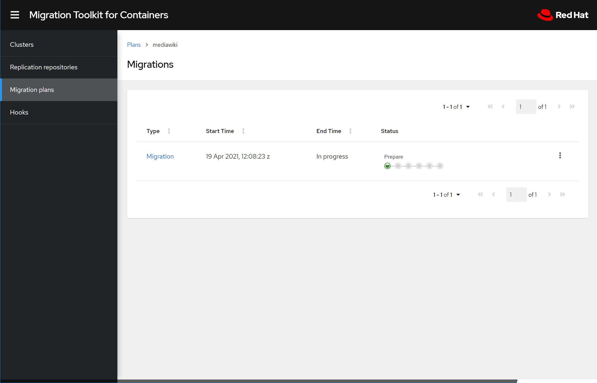
+
. Watch it work until completion.
+
image:./screenshots/lab8/mtc-migplan-complete.png[MTC Mig Plan Migrate]
+
. Once the migration has completed, let's verify that MediaWiki has been migrated and that the hook has our route pointed properly at the OCP 4 cluster.
+
[source,sh]
----
oc get route mediawiki -n mediawiki -o jsonpath='{.spec.host}{"\n"}'
----
+
.Sample Output
[source,textinfo]
----
mediawiki-mediawiki.apps.cluster-{OCP4_GUID}.{OCP4_GUID}.{OCP4_DOMAIN}
----
+
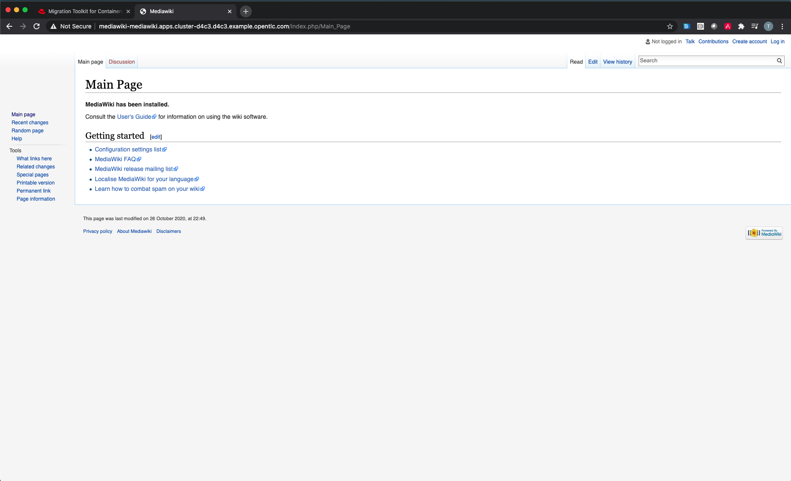

*Success!*  
In the next lab, we will explore some debugging techniques for when migrations don't go quite as planned.
