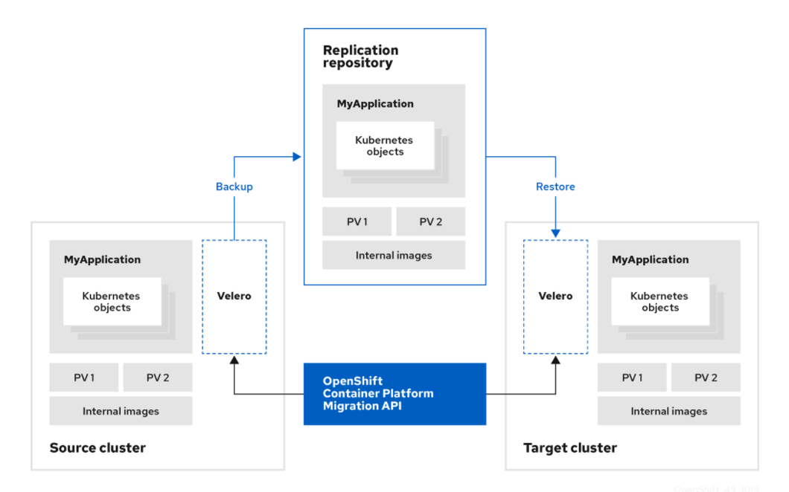
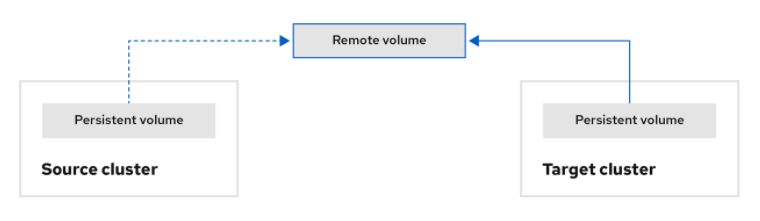
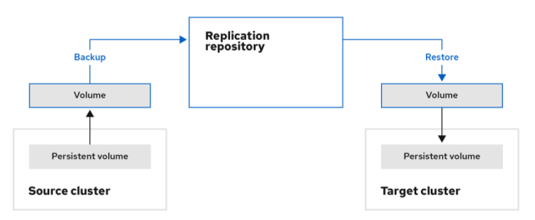

:sectlinks:
:markup-in-source: verbatim,attributes,quotes
:OCP3_GUID: %ocp3_guid%
:OCP3_DOMAIN: %ocp3_domain%
:OCP3_SSH_USER: %ocp3_ssh_user%
:OCP3_PASSWORD: %ocp3_password%
:OCP4_GUID: %ocp4_guid%
:OCP4_DOMAIN: %ocp4_domain%
:OCP4_SSH_USER: %ocp4_ssh_user%
:OCP4_PASSWORD: %ocp4_password%
:OCP3_BASTION: %ocp3_bastion%
:OCP4_BASTION: %ocp4_bastion%

The Migration Toolkit for Containers (MTC) is designed to migrate Application Workloads between OpenShift clusters. Specifically, MTC handles migration of k8s resource objects, persistent volumes, and internal images. MTC is designed to provide a migration experience while focusing on minimizing application downtime through the process.

=== Upstream Projects

MTC leverages two upstream projects: https://github.com/heptio/velero[Velero] and https://restic.net/[Restic]. Velero (formerly Heptio Ark) gives you tools to back up and restore your Kubernetes cluster resources and persistent volumes. Restic is a backup program that is fast, efficient and secure.

=== Architecture

MTC is implemented as a native k8s API extension through a custom resource definition. MTC orchestrates usage of Velero for performing backup/restores. OpenShift specific functionality is implemented in a series of Velero plugins. MTC is also equipped with a React/Patternfly 4 web UI to provide simple interactive experience.

IMPORTANT: Migration is at scope of a Namespace. +
Future versions will allow selecting resources inside of a Namespace.

IMPORTANT: `cluster-admin` role is currently required to execute migrations. +
Future versions will allow for application owners to plan and execute migrations.

=== Persistent Volume Handling

MTC provides two methods for migrating persistent volumes:

*Move*:: Move or "`swinging`" the PV recreates the PVC/PV definitions from source cluster to destination cluster. This option is highly desirable for environments with shared storage between the source and target clusters (i.e. NFS).

*Copy*:: Copy creates a copy of the data from source cluster into the destination cluster. This option involves creating a PVC on destination and allowing cluster to find a PV to bind to the claim. We then copy data into the PV.

=== Actions (Stage and Migrate)

MTC introduces two actions on a Migration Plan:

* *Stage* - Seeds data while leaving application up and running.
* *Migrate* - Quiesces the application and migrates deltas from stage runs.

NOTE: Stage can be run multiple times on a Migration Plan

NOTE: Migrate can only be run once.

=== Migration Process

There are 3 steps to the migration process within MTC:

. *Plan*

* Select source cluster
* Select namespaces
* Choose Copy or Move for each Persistent volume
* Specify intermediate object storage
* Select destination cluster

. *Stage*

* Stages the data from source to destination cluster
* May be run multiple times
* No downtime during this step for source applications

. *Migrate*

* Quiesce the application
* Migrate any delta state since last stage run

=== WebUI

We should already have MTC UI opened from the previous steps. In case you don't have it open let’s bring up the webUI in preparation for our first Application Migration in Lab 4. In the destination OCP 4 cluster terminal, let’s run the following commands to get the route:

[source,subs="{markup-in-source}"]
--------------------------------------------------------------------------------
$ **oc get routes migration -n openshift-migration -o jsonpath='{.spec.host}{"\n"}'**
migration-openshift-migration.apps.cluster-{OCP4_GUID}.{OCP4_GUID}.{OCP4_DOMAIN}
--------------------------------------------------------------------------------

Next, open a browser to the route from above.  +
https://migration-openshift-migration.apps.cluster-{OCP4_GUID}.{OCP4_GUID}.{OCP4_DOMAIN}

image:./screenshots/lab2/mtcUI.png[MTC Main Screen]

We are now ready to perform our first Application Migration.
