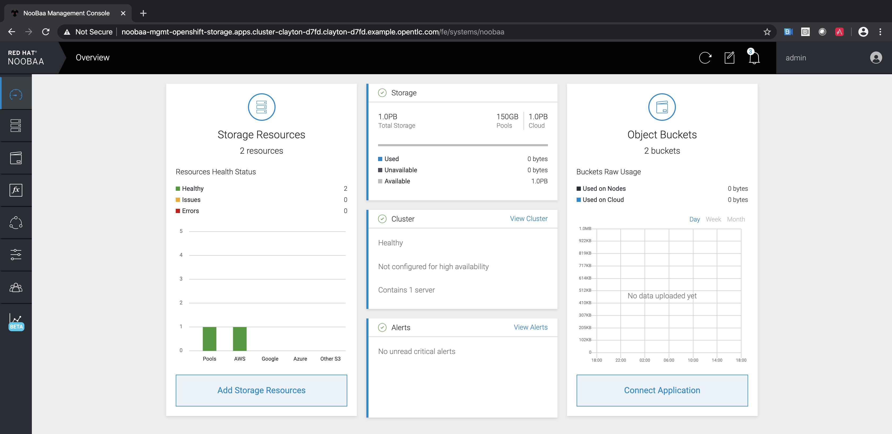

:sectlinks:
:markup-in-source: verbatim,attributes,quotes
:OCP3_GUID: %ocp3_guid%
:OCP3_DOMAIN: %ocp3_domain%
:OCP3_SSH_USER: %ocp3_ssh_user%
:OCP3_PASSWORD: %ocp3_password%
:OCP4_GUID: %ocp4_guid%
:OCP4_DOMAIN: %ocp4_domain%
:OCP4_SSH_USER: %ocp4_ssh_user%
:OCP4_PASSWORD: %ocp4_password%
:OCP3_BASTION: %ocp3_bastion%
:OCP4_BASTION: %ocp4_bastion%

Required versions of products used:

[cols=",",options="header",]
|===
|Product |Versions
|OpenShift 3.x |v3.7+
|OpenShift 4.x |v4.1+
|===

Additionally, temporary object storage will be required perform a migration. For example, this can be provided through: https://aws.amazon.com/s3/[AWS S3], https://www.noobaa.io/[NooBaa], https://min.io/[Minio], or others.

=== Base requirements

* A computer with access to the Internet :-)
* SSH client
* Firefox 17 or higher, or Chromium / Chrome
* oc client

=== Accessing OCP 3 and OCP 4 clusters

As we will be interacting with both the source and destination cluster throughout the course of this lab, let’s go ahead and open two terminal windows.
You should keep these open throughout the lab.

The first terminal window will be used for the source *OCP 3* cluster. +
In that window, let's go ahead and ssh into the bastion host, and then login into the *OCP 3* cluster:

[source,bash,subs="{markup-in-source}"]
--------------------------------------------------------------------------------
$ **ssh {OCP3_SSH_USER}@{OCP3_BASTION}**
{OCP3_SSH_USER}@{OCP3_BASTION}'s password:
Last login: Sun Mar 22 21:22:55 2020 from 66.26.68.90
[{OCP3_SSH_USER}@bastion 0 ~]$
--------------------------------------------------------------------------------

Run `oc login` command to log into your OCP3 cluster from the terminal:

[source,bash,subs="{markup-in-source}"]
--------------------------------------------------------------------------------
$ **oc login https://master.{OCP3_GUID}.{OCP3_DOMAIN} -u admin -p {OCP3_PASSWORD}**
The server uses a certificate signed by an unknown authority.
You can bypass the certificate check, but any data you send to the server could be intercepted by others.
Use insecure connections? (y/n): y
...
Login successful.
--------------------------------------------------------------------------------

The second terminal window will be used for the destination *OCP 4* cluster.
In case you are not logged in there already, let's log into the *OCP 4* cluster's bastion:

[source,subs="{markup-in-source}"]
--------------------------------------------------------------------------------
$ **ssh {OCP4_SSH_USER}@{OCP4_BASTION}**
{OCP4_SSH_USER}@{OCP4_BASTION}'s password:
Last login: Sun Mar 22 21:22:55 2020 from 66.26.68.90
[{OCP4_SSH_USER}@bastion 0 ~]$
--------------------------------------------------------------------------------

Run `oc login` command to log into your OCP4 cluster from the terminal:

[source,subs="{markup-in-source}"]
--------------------------------------------------------------------------------
$ **oc login https://api.cluster-{OCP4_GUID}.{OCP4_GUID}.{OCP4_DOMAIN}:6443 -u admin -p {OCP4_PASSWORD}**
Login successful.

You have access to 65 projects, the list has been suppressed. You can list all projects with 'oc projects'

Using project "lab-instructions".
--------------------------------------------------------------------------------

=== Verifications

==== Verify OCP 3 environment

In the source *OCP 3* cluster terminal, perform the following:

. Verify that the `migration-operator` deployment is running in `openshift-migration` namespace and healthy.

[source,subs="{markup-in-source}"]
--------------------------------------------------------------------------------
$ **oc get deployment migration-operator -n openshift-migration**
NAME                 DESIRED   CURRENT   UP-TO-DATE   AVAILABLE   AGE
migration-operator   1         1         1            1           5m
--------------------------------------------------------------------------------

[start=2]
. Verify that `velero` is now running on the source in the `mig` namespace.

[source,subs="{markup-in-source}"]
--------------------------------------------------------------------------------
$ **oc get pods -n openshift-migration | grep velero**
velero-7559946c5c-mh5sp               1/1     Running   0          2m
--------------------------------------------------------------------------------

==== Verify OCP 4 environment

Now switch to the *OCP 4* cluster terminal tab and perform the following:

. Verify that you see the below pods now running in `openshift-migration` namespace, we are looking for pods of `migration-controller`, `velero`, `migration-ui`, and `restic`.

[source,subs="{markup-in-source}"]
--------------------------------------------------------------------------------
$ **oc get pods -n openshift-migration**
NAME                                    READY   STATUS    RESTARTS   AGE
migration-controller-5fbcc478bb-jz76t   2/2     Running   0          50m
migration-log-reader-7cdc99c6c4-rx2k2   2/2     Running   0          50m
migration-operator-589b4d4d69-pwpdb     1/1     Running   0          51m
migration-ui-5c65487687-hzv4m           1/1     Running   0          50m
restic-984s8                            1/1     Running   0          51m
restic-bdmpg                            1/1     Running   0          51m
restic-klhmw                            1/1     Running   0          51m
velero-cd5cd48b6-z47px                  1/1     Running   0          51m
--------------------------------------------------------------------------------

=== Prepare to use MTC UI from OCP 4 Cluster in your Browser

. To visit the ui, obtain the route from the OCP 4 Cluster

[source,subs="{markup-in-source}"]
--------------------------------------------------------------------------------
$ **oc get routes migration -n openshift-migration -o jsonpath='{.spec.host}{"\n"}'**
migration-openshift-migration.apps.cluster-{OCP4_GUID}.{OCP4_GUID}.{OCP4_DOMAIN}
--------------------------------------------------------------------------------

[start=2]
. For this example we’ll need to accept all the self-signed certificates before we can visit the MTC UI. Please click through and accept any self-signed certificates. You can ignore page errors if some occur:

==== Accept API Certificates on Source and Destination Clusters

. Since we are using self-signed certificates, before you can access the MTC UI, you will need to accept the certificates with your browser on both the source and destination clusters. To do this:

* Visit the links displayed by the Web UI. If there is a pop-up requesting "Refresh" just cancel it, and follow the hyperlinks. Here are the links you will need to follow:
** OCP4:
*** OCP 4.x: https://api.cluster-{OCP4_GUID}.{OCP4_GUID}.{OCP4_DOMAIN}:6443/.well-known/oauth-authorization-server
*** OCP 4.x: https://discovery-openshift-migration.apps.cluster-{OCP4_GUID}.{OCP4_GUID}.{OCP4_DOMAIN}/namespaces/openshift-migration/clusters/host/namespaces
** OCP3:
*** OCP 3.x: https://master.{OCP3_GUID}.{OCP3_DOMAIN}/.well-known/oauth-authorization-server
*** OCP 3.x: https://master.{OCP3_GUID}.{OCP3_DOMAIN}/api/v1/namespaces
* After accepting the API certs, reload the MTC UI URL.
* Get redirected to login page.

Finally we can go to the MTC UI:

* https://migration-openshift-migration.apps.cluster-{OCP4_GUID}.{OCP4_GUID}.{OCP4_DOMAIN}

[start=2]
. Login with your credentials for the cluster.

* Username: admin
* Password: `{OCP4_PASSWORD}`

image:screenshots/lab2/mtcUI.png[MTC UI]

=== Object Storage Setup

MTC leverages object storage as a temporary scratch space when performing migrations. This storage can be any object storage that presents an `S3 like` interface.

For the purposes of this lab, we have already deployed OCS MCG (Noobaa) on the OCP 4 cluster, created a bucket, and configured it for use with MTC.

[arabic]
. You can see this by clicking the `Replication repositories` tab in the left-hand navigation from the MTC UI dashboard.

image:screenshots/lab2/mtc-replication-repository.png[MTC Replication Repository]

[arabic, start=2]
. Additionally, you can query the bucket and service route in OCP4 terminal as seen below:

[source,subs="{markup-in-source}"]
--------------------------------------------------------------------------------
$ **oc get ObjectBucketClaim -n openshift-storage**
NAME         STORAGE-CLASS                 PHASE   AGE
migstorage   openshift-storage.noobaa.io   Bound   116
...
$ **oc get service s3 -n openshift-storage**
NAME   TYPE           CLUSTER-IP       EXTERNAL-IP                                                               PORT(S)                      AGE
s3     LoadBalancer   172.30.209.151   ab6e67b04f2fc4ad1bb126ad89db0962-1796725410.us-east-1.elb.amazonaws.com   80:32124/TCP,443:32154/TCP   116m
--------------------------------------------------------------------------------

[arabic, start=3]
. You can also access the Noobaa Mgmt console. When you visit the Web UI it will ask you to accept self-signed certificates.

[source,subs="{markup-in-source}"]
--------------------------------------------------------------------------------
$ **oc get routes noobaa-mgmt -n openshift-storage -o jsonpath='{.spec.host}{"\n"}'**
noobaa-mgmt-openshift-storage.apps.cluster-{OCP4_GUID}.{OCP4_GUID}.{OCP4_DOMAIN}
--------------------------------------------------------------------------------

After giving your credentials, NooBaa service account will ask for permission to access your admin account.
You need to allow this access to proceed. After that you will be presented with the NooBaa management overview:

Let’s now take a closer look at the Migration Toolkit for Containers (MTC).
