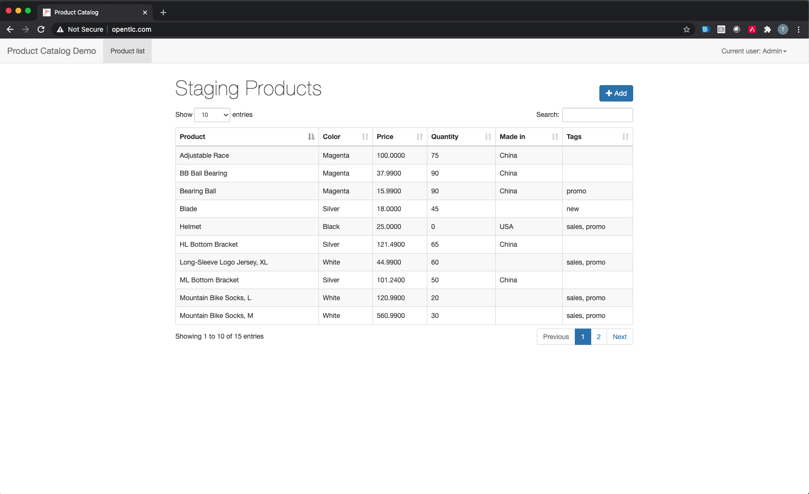
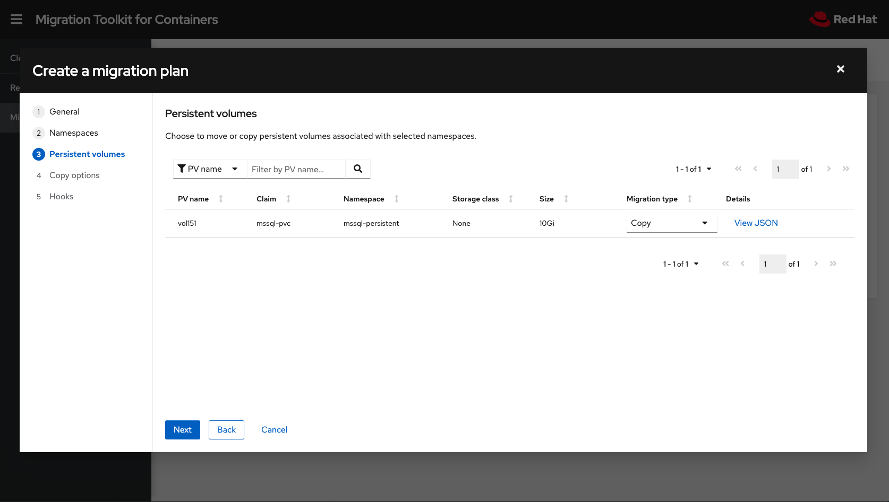
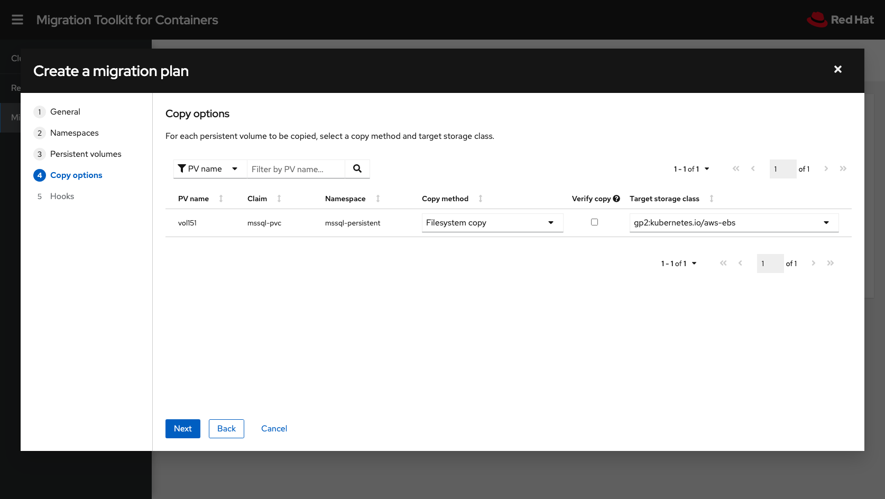
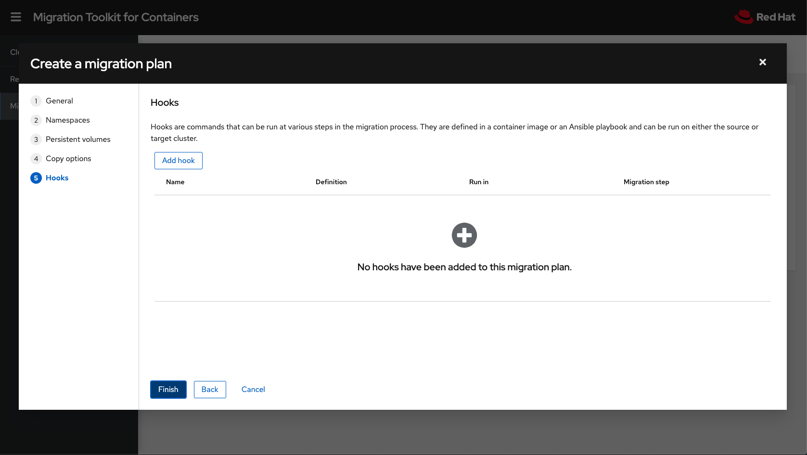
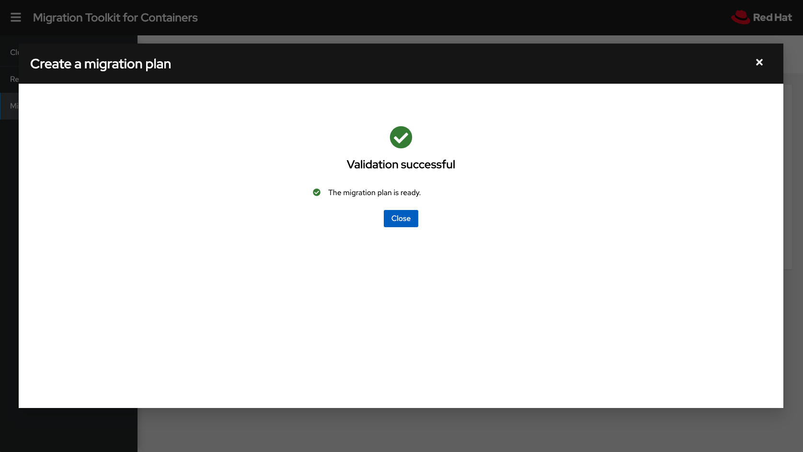
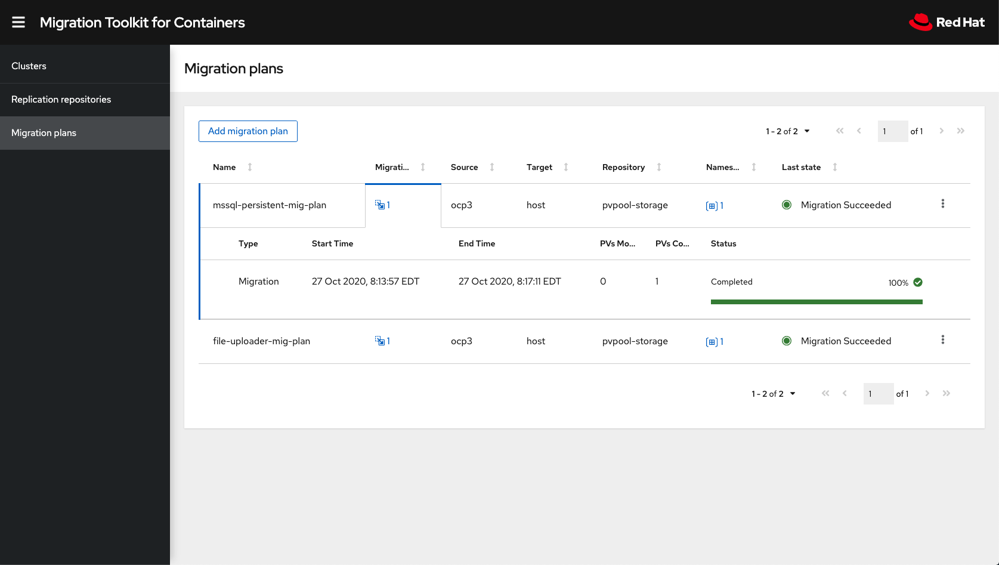
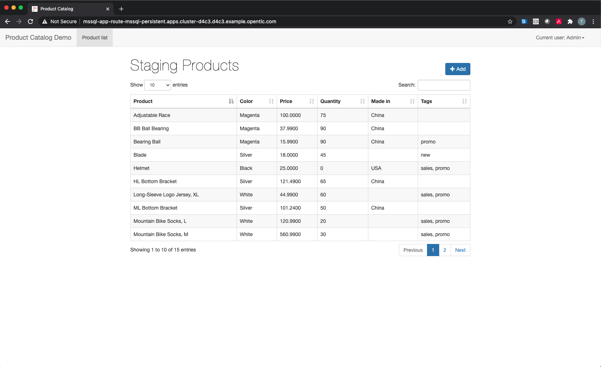

:sectlinks:
:markup-in-source: verbatim,attributes,quotes
:OCP3_GUID: %ocp3_guid%
:OCP3_DOMAIN: %ocp3_domain%
:OCP3_SSH_USER: %ocp3_ssh_user%
:OCP3_PASSWORD: %ocp3_password%
:OCP4_GUID: %ocp4_guid%
:OCP4_DOMAIN: %ocp4_domain%
:OCP4_SSH_USER: %ocp4_ssh_user%
:OCP4_PASSWORD: %ocp4_password%

== Migrate MSSQL Application

Next, we are going to migrate a simple Product Inventory web-based application front-end, backed backed by Microsoft SQL Server. This application has been pre-deployed on your OCP 3 cluster in the mssql-persistent namespace, using a single PV backed by NFS for persistent storage.

In our source OCP 3 cluster terminal, we can see the app running:

[source,subs="{markup-in-source}"]
--------------------------------------------------------------------------------
$ **oc get pods -n mssql-persistent**
NAME                                    READY   STATUS    RESTARTS   AGE
mssql-app-deployment-6ffb46c5d6-n5fvv   1/1     Running   0          41m
mssql-deployment-1-xq4p4                1/1     Running   0          41m
--------------------------------------------------------------------------------

Let’s get the route to the application, and bring up the webUI.

[source,subs="{markup-in-source}"]
--------------------------------------------------------------------------------
$  **oc get route -n mssql-persistent**
NAME              HOST/PORT                                                       PATH   SERVICES     PORT   TERMINATION   WILDCARD
mssql-app-route   mssql-app-route-mssql-persistent.apps.{OCP3_GUID}.{OCP3_DOMAIN}         db-app-svc   5000                 None
--------------------------------------------------------------------------------

image:../screenshots/lab5/mssql-product-catalog.png[MSSQL Product Catalog]

Let’s go ahead and add a new product to the inventory. Click on the +Add button and enter some data.

image:../screenshots/lab5/mssql-add-product.png[MSSQL Add Product]

You can see the application is functioning and state is being saved in the DB.

Let’s also verify that the application is NOT installed on our OCP 4 destination cluster. You can see that no pods are running; and in fact the mssql-persistent namespace does _not_ exist.

[source,subs="{markup-in-source}"]
--------------------------------------------------------------------------------
$ **oc get pods -n mssql-persistent**
No resources found.
--------------------------------------------------------------------------------

=== Using MTC

Let’s go ahead and define our Migration Plan in the MTC UI.

==== Create a Migration Plan

image:../screenshots/lab5/mtc-migplan-general.png[MTC Mig Plan General]

Give your plan a name, select the source and destination clusters, and your replication repository.  Then click Next.

image:../screenshots/lab5/mtc-migplan-namespaces.png[MTC Mig Plan Namespaces]

Select the `mssql-persistent` namespace/project, and click Next.

Next, we will need to select the `copy method` and `target storage class`.  MTC will attempt to pre-select these for you as defaults.  In our case, we want to copy our data from NFS to AWS-EBS (`gp2:kubernetes.io/aws-ebs`). Click Next.

Select the storage class for your PVs. In this case we will be copying our data from NFS to AWS-EBS (`gp2:kubernetes.io/aws-ebs`). Click Next.

We will examine Migration Hooks in Lab 9, so we will skip this step and proceed.  Click Finish.

After validating the migration plan, you will see a `Ready` message and you can click `Close`.

==== Migrate the Application Workload

Now we can select `Migrate` or `Stage` on the application. Since we don’t care about downtime for this example, let’s select `Migrate`:

image:../screenshots/lab5/mtc-migplan-migrate.png[MTC Mig Plan Migrate]

Optionally choose to _not_ terminate the application on the source cluster. Leave it unchecked and select `Migrate`.

image:../screenshots/lab5/mtc-migplan-quiesce.png[MTC Mig Plan Quiesce]

The migration will progress with a progress bar showing each step in the process.

image:../screenshots/lab5/mtc-migplan-progress.png[MTC Mig Plan Progress]

Once done, you should see `Migration Succeeded` on the migration plan.

=== Verify Migrated Application

In the destination OCP 4 cluster terminal, let’s execute the following commands:

[source,subs="{markup-in-source}"]
--------------------------------------------------------------------------------
$ **oc get pods -n mssql-persistent**
NAME                                    READY   STATUS      RESTARTS   AGE
mssql-app-deployment-7cc7954fd8-swlkx   1/1     Running     0          3m55s
mssql-deployment-1-deploy               0/1     Completed   0          3m58s
mssql-deployment-1-wllln                1/1     Running     0          3m55s
--------------------------------------------------------------------------------

We see that the mssql-persistent application is running.

Let’s check the storage:

[source,subs="{markup-in-source}"]
--------------------------------------------------------------------------------
$ **oc get pvc -n mssql-persistent**
NAME        STATUS   VOLUME                                     CAPACITY   ACCESS MODES   STORAGECLASS   AGE
mssql-pvc   Bound    pvc-c0e077ea-e1c7-4ba7-a48e-051de94296fa   10Gi       RWO            gp2            4m52s
--------------------------------------------------------------------------------

We see that our 10Gi volume has been moved and is now running in AWS EBS.

Lastly, let’s grab the route and open up the WebUI in our browser, and verify that the product we added prior to migration still exists.

[source,subs="{markup-in-source}"]
--------------------------------------------------------------------------------
$ **oc get routes -n mssql-persistent**
NAME              HOST/PORT                                                    PATH   SERVICES            PORT    TERMINATION   WILDCARD
mssql-app-route   mssql-app-route-mssql-persistent.apps.cluster-{OCP4_GUID}.{OCP4_GUID}.{OCP4_DOMAIN}    /      mssql-app-service   <all>                 None
--------------------------------------------------------------------------------

