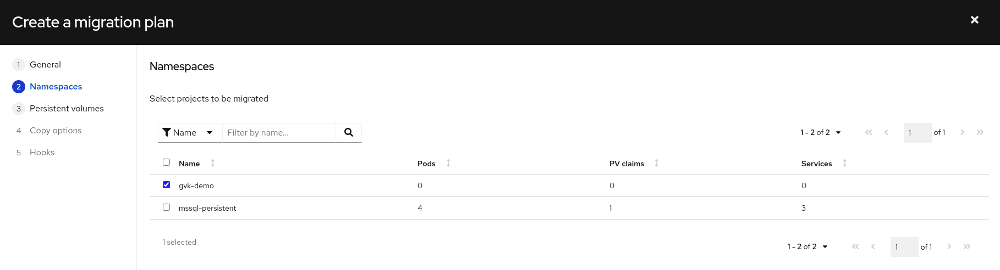
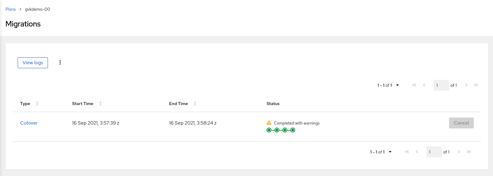
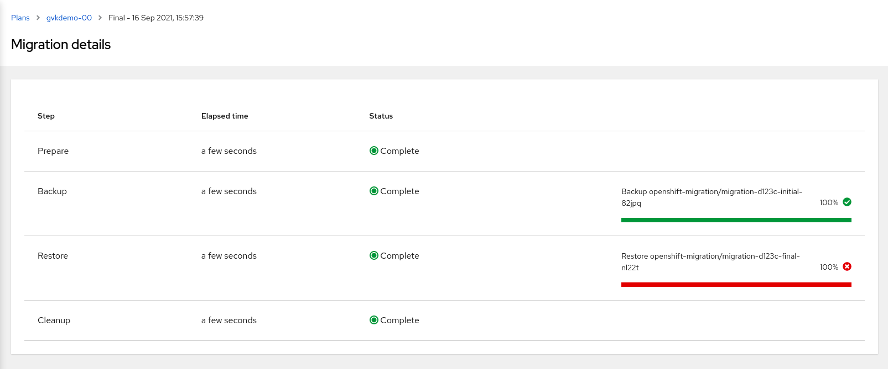
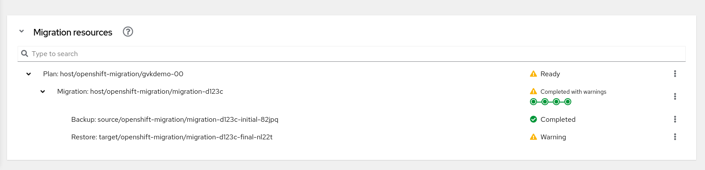
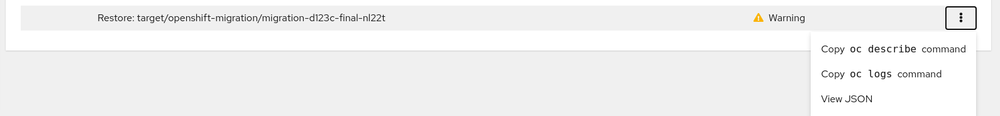

:sectlinks:
:markup-in-source: verbatim,attributes,quotes
:OCP3_GUID: %ocp3_guid%
:OCP3_DOMAIN: %ocp3_domain%
:OCP3_SSH_USER: %ocp3_ssh_user%
:OCP3_PASSWORD: %ocp3_password%
:OCP4_GUID: %ocp4_guid%
:OCP4_DOMAIN: %ocp4_domain%
:OCP4_SSH_USER: %ocp4_ssh_user%
:OCP4_PASSWORD: %ocp4_password%

== Exercise 3 : GVK Incompatability

This exercise will guide you through a failed migration scenario due to incompatible GVKs between the source and the destination cluster. It will help you with techniques to identify the problem through investigation different migration resources; as well as resolve the problem through resource upgrades.

=== Background

We have pre-installed a new Custom Resource Definition (`GvkDemo`) on your OCP 3 source cluster and created an instance within the `gvk-demo` namespace.  A different version of the same CRD has been installed on your OCP 4 destination cluster.

=== Migrate GVK incompatible namespace

Let's launch MTC and create a Migration Plan to migrate the gvk-demo namespace.



Run a migration by clicking _Migrate_ option from the dropdown menu on the migration plan.

The migration will complete with message: `Completed with warnings`



The Warning message indicates that the migration ran to completion, however, one of the steps in the migration failed.  Navigate to the details page of the migration by clicking on the link under the `Type` column:



As shown in the details page above, the `Restore` step in the migration failed.  This step is responsible for restoring the Kubernetes objects in the target cluster.


=== Investigate

MTC UI displays a _Debug View_ to list Kubernetes resources created during a migration. It is updated dynamically as and when the new resources are created or when there are updates to the existing resources. It can be found on the migration details page at the bottom of the page:



Find the Restore that appears to have problems and click on the dropdown menu:



Click `copy oc describe command` link. It will copy the `oc` command to the clipboard. Login to the destination cluster and run the command:

```sh
$ oc describe restore --namespace openshift-migration migration-d123c-final-nl22t
Name:         migration-d123c-final-nl22t
Namespace:    openshift-migration
Labels:       app.kubernetes.io/part-of=openshift-migration
              migmigration=4993595a-995f-45df-9d4e-80161a716dc9
              migration-final-restore=4993595a-995f-45df-9d4e-80161a716dc9
              migration.openshift.io/migmigration-name=migration-d123c
              migration.openshift.io/migplan-name=gvkdemo-00
              migration.openshift.io/migrated-by-migmigration=4993595a-995f-45df-9d4e-80161a716dc9
              migration.openshift.io/migrated-by-migplan=e0d4b8d6-3ddc-4ff2-8c41-3f15bbb98d56
Annotations:  migration.openshift.io/migmigration-type: final
API Version:  velero.io/v1
Kind:         Restore
Metadata:
  Creation Timestamp:  2021-09-16T15:58:01Z
  Generate Name:       migration-d123c-final-
  Generation:          6
  Resource Version:  4208804
Spec:
  Backup Name:  migration-d123c-initial-82jpq
  Excluded Resources:
    nodes
    events
    events.events.k8s.io
    backups.velero.io
    restores.velero.io
    resticrepositories.velero.io
  Hooks:
  Restore P Vs:  true
Status:
  Completion Timestamp:  2021-09-16T15:58:05Z
  Errors:                1
  Phase:                 PartiallyFailed
  Progress:
    Items Restored:  23
    Total Items:     23
  Start Timestamp:   2021-09-16T15:58:01Z
  Warnings:          7
Events:              <none>
```

By inspecting the `Status` field of the resource above we can see that the restore `PartiallyFailed`.

We will now locate the tarball associated with this restore in the _Replication Repository_ and download the archive.


Let's login to the Noobaa console.  Again, you can obtain the route with the following command on your OCP 4 cluster:

[source,subs="{markup-in-source}"]
--------------------------------------------------------------------------------
$ oc get routes noobaa-mgmt -n openshift-storage -o jsonpath='{.spec.host}'
noobaa-mgmt-openshift-storage.apps.cluster-b6b0.b6b0.example.opentlc.com
--------------------------------------------------------------------------------

***Note: The noobaa console is only served over https***

Once logged in, we mneed to find the `migstorage` bucket. Within the bucket, find the directory associated with the restore by navigating through `velero -> restores -> <your_restore_directory>`. The restore directory is named after the name of the Velero Restore mentioned in _MigMigration_.

image:../../screenshots/debug/ex3/migstorage-bucket.png[MigStorage Bucket]

Download the `restore-<restore_name>-results.gz` archive. Extract the archive to find a file which contains useful information about the partially failed restore. This file contains list of warnings and errors in a JSON format. We are interested in knowing the errors:

```json
{"errors":{"namespaces":{"gvk-demo":["error restoring gvkdemoes.konveyor.openshift.io/gvk-demo/gvk-demo: the server could not find the requested resource"]}}}
```

From the error message above, it is clear that Velero failed to restore the Custom Resource `gvkdemoes.konveyor.openshift.io` we created.

Let's take a closer look at the `GvkDemo` CRD on both source and destination:

==== Source OCP 3

[source,subs="{markup-in-source}"]
--------------------------------------------------------------------------------
$ **oc get crd gvkdemoes.konveyor.openshift.io -o yaml**
apiVersion: apiextensions.k8s.io/v1beta1
kind: CustomResourceDefinition
metadata:
  creationTimestamp: "2020-11-06T13:54:47Z"
  generation: 1
  name: gvkdemoes.konveyor.openshift.io
  resourceVersion: "8403"
  selfLink: /apis/apiextensions.k8s.io/v1beta1/customresourcedefinitions/gvkdemoes.konveyor.openshift.io
  uid: a196c0b0-2037-11eb-8bad-0eeedacb25b5
spec:
  additionalPrinterColumns:
  - JSONPath: .metadata.creationTimestamp
    description: |-
      CreationTimestamp is a timestamp representing the server time when this object was created. It is not guaranteed to be set in happens-before order across separate operations. Clients may not set this value. It is represented in RFC3339 form and is in UTC.

      Populated by the system. Read-only. Null for lists. More info: https://git.k8s.io/community/contributors/devel/api-conventions.md#metadata
    name: Age
    type: date
  group: konveyor.openshift.io
  names:
    kind: GvkDemo
    listKind: GvkDemoList
    plural: gvkdemoes
    singular: gvkdemo
  scope: Namespaced
  subresources:
    status: {}
  version: v1alpha1
  versions:
  - name: v1alpha1
    served: true
    storage: true
status:
  acceptedNames:
    kind: GvkDemo
    listKind: GvkDemoList
    plural: gvkdemoes
    singular: gvkdemo
  conditions:
  - lastTransitionTime: "2020-11-06T13:54:47Z"
    message: no conflicts found
    reason: NoConflicts
    status: "True"
    type: NamesAccepted
  - lastTransitionTime: null
    message: the initial names have been accepted
    reason: InitialNamesAccepted
    status: "True"
    type: Established
  storedVersions:
  - v1alpha1
--------------------------------------------------------------------------------

==== Destination OCP 4

[source,subs="{markup-in-source}"]
--------------------------------------------------------------------------------
$ **oc get crd gvkdemoes.konveyor.openshift.io -o yaml**
apiVersion: apiextensions.k8s.io/v1
kind: CustomResourceDefinition
metadata:
  creationTimestamp: "2020-11-06T14:12:33Z"
  generation: 1
  name: gvkdemoes.konveyor.openshift.io
  resourceVersion: "29992"
  selfLink: /apis/apiextensions.k8s.io/v1/customresourcedefinitions/gvkdemoes.konveyor.openshift.io
  uid: 95ffd09d-bfed-427f-a843-d83cfffd677e
spec:
  conversion:
    strategy: None
  group: konveyor.openshift.io
  names:
    kind: GvkDemo
    listKind: GvkDemoList
    plural: gvkdemoes
    singular: gvkdemo
  preserveUnknownFields: true
  scope: Namespaced
  versions:
  - name: v1
    served: true
    storage: true
    subresources:
      status: {}
status:
  acceptedNames:
    kind: GvkDemo
    listKind: GvkDemoList
    plural: gvkdemoes
    singular: gvkdemo
  conditions:
  - lastTransitionTime: "2020-11-06T14:12:33Z"
    message: no conflicts found
    reason: NoConflicts
    status: "True"
    type: NamesAccepted
  - lastTransitionTime: "2020-11-06T14:12:33Z"
    message: the initial names have been accepted
    reason: InitialNamesAccepted
    status: "True"
    type: Established
  storedVersions:
  - v1

--------------------------------------------------------------------------------

As you can see, we have a CRD version mismatch.  `v1alpha1` on the source cluster and `v1` on the destination cluster.


==== How to Resolve

There are numerous ways to fix this situation depending on the API (CRD) changes themselves or number of versions between the differing versions;
`alpha to beta` changes can be extensive, where `beta to v1` tend to be minimal.
In the most simplest form, you could export the resource yaml on the source side, manually edit to make the version changes, and finally apply to the destination cluster.   Additionally,
there are tools, such as `kubectl-convert` that can assist with making these types of resource conversions.
