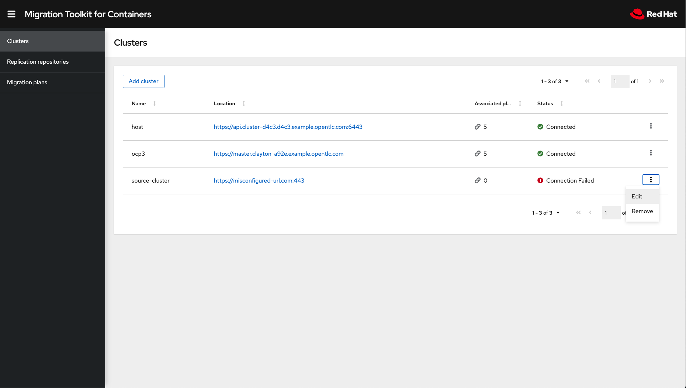
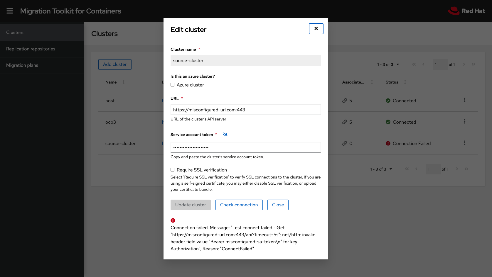
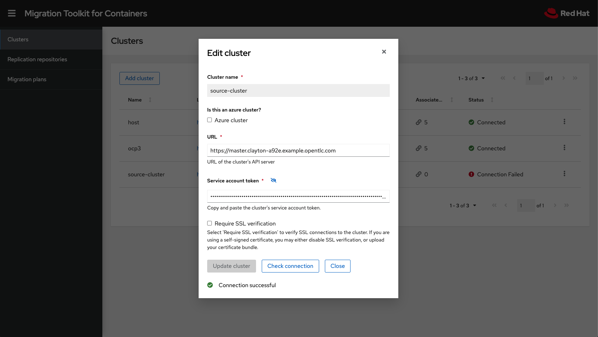
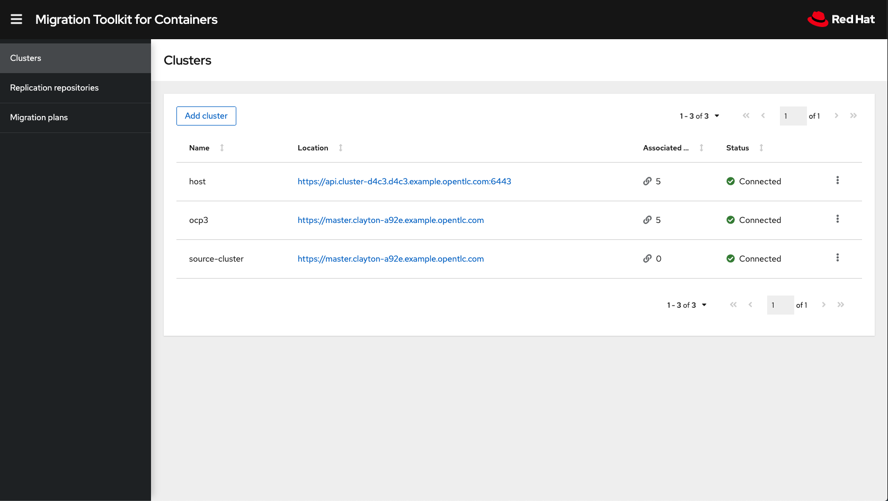

:sectlinks:
:markup-in-source: verbatim,attributes,quotes
:OCP3_GUID: %ocp3_guid%
:OCP3_DOMAIN: %ocp3_domain%
:OCP3_SSH_USER: %ocp3_ssh_user%
:OCP3_PASSWORD: %ocp3_password%
:OCP4_GUID: %ocp4_guid%
:OCP4_DOMAIN: %ocp4_domain%
:OCP4_SSH_USER: %ocp4_ssh_user%
:OCP4_PASSWORD: %ocp4_password%

== Exercise 1 : Misconfiguration

In this exercise we will create some misconfigured MTC custom resources. We will then locate and fix those resources to drive towards a successful migration.

=== Create Misconfigured CRs

On the OCP4 Bastion Host, you will find a ~/files/debug/ex1 directory.  oc login to your destination OCP 4 cluster and apply the `01-misconfig.yml` CRs using:

[source,subs="{markup-in-source}"]
--------------------------------------------------------------------------------
$ **oc apply -f 01-misconfig.yml**
secret/source-cluster-secret created
migcluster.migration.openshift.io/source-cluster created
secret/s3-repository created
migstorage.migration.openshift.io/s3-repository created
--------------------------------------------------------------------------------

This will create _Cluster_ and _Replication Repository_ resources that are intentionally misconfigured.

Let's bring up the MTC UI:

As you can see the new source-cluster entry has a status of **Connection Failed**.  Let's click on the elipses and select `Edit`:

A Connection Failure is likely caused by an incorrectly specified cluster URL and/or an incorrectly specified Service account token.  Let's proceed with updating both for our source OCP3 cluster and re-validate the connection.  Enter in this information and click `Update cluster`.

Note: The Service account token can be found with the following command on the OCP 3 cluster:

--------------------------------------------------------------------------------
$ **oc sa get-token migration-controller -n openshift-migration**
eyJhbGciOiJSUzI1NiIsImtpZCI6IiJ9.eyJpc3MiOiJrdWJlcm5ldGVzL3NlcnZpY2VhY2NvdW50Iiwia3ViZXJuZXRlcy5pby9zZXJ2aWNlYWNjb3VudC9uYW1lc3BhY2UiOiJvcGVuc2hpZnQtbWlncmF0aW9uIiwia3ViZXJuZXRlcy5pby9zZXJ2aWNlYWNjb3VudC9zZWNyZXQubmFtZSI6Im1pZ3JhdGlvbi1jb250cm9sbGVyLXRva2VuLThibTQ3Iiwia3ViZXJuZXRlcy5pby9zZXJ2aWNlYWNjb3VudC9zZXJ2aWNlLWFjY291bnQubmFtZSI6Im1pZ3JhdGlvbi1jb250cm9sbGVyIiwia3ViZXJuZXRlcy5pby9zZXJ2aWNlYWNjb3VudC9zZXJ2aWNlLWFjY291bnQudWlkIjoiMDdlMmU1ZmYtMTdkZC0xMWViLTlhMjEtMDI3MDQ5NzNlNzgzIiwic3ViIjoic3lzdGVtOnNlcnZpY2VhY2NvdW50Om9wZW5zaGlmdC1taWdyYXRpb246bWlncmF0aW9uLWNvbnRyb2xsZXIifQ.iXYDHX7WdGeSE7ugspm9t4_sEBzGp6SNGM_0Y31uGywECESTJ2C7K_nEIIfSp8q1WsAfrRJcZh1cA-EjB-eV1syjWZeIz00MGmIPKLXPwBP990PSkFvRRPjwhCMWn4dbgyJiwjxVW2CqR06XcpHefcAd2zbyg96as36_RR8XP_qovBEQHAoeMfnEcSrdMLE5J5R8HBgmcgSvsVpSv7-RoavfMUcHT-e91277eLZJcdNM-4tGAyOk2C6LlZXzVJdOVdUawqC7f80eCgDkaDutt6RLqRQ3F4r8_Awr0olmdv8dxeLbm7IVEt8wX3ZrtM6l8vphJZAsXYtuX6mXRkh-BQ
--------------------------------------------------------------------------------

Upon update, the cluster connection will be re-validated.  If successful, the status will change to *Connected*, and we are ready to use this source cluster in our Migration Plans.

