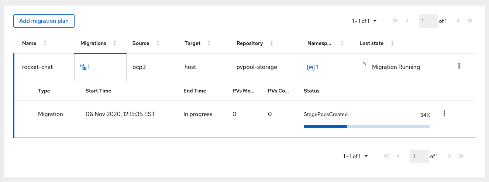

:sectlinks:
:markup-in-source: verbatim,attributes,quotes
:OCP3_GUID: %ocp3_guid%
:OCP3_DOMAIN: %ocp3_domain%
:OCP3_SSH_USER: %ocp3_ssh_user%
:OCP3_PASSWORD: %ocp3_password%
:OCP4_GUID: %ocp4_guid%
:OCP4_DOMAIN: %ocp4_domain%
:OCP4_SSH_USER: %ocp4_ssh_user%
:OCP4_PASSWORD: %ocp4_password%

== Exercise 2 : Stage Pod Failures

When filesystem copy mode is selected, MTC makes use of temporary pods which attach the PVs and trigger a filesystem copy through Restic. In this exercise, we will trigger a failure in the Stage Pods and try to fix the issue manually.

## Prepare

MTC uses `migration-cluster-config` configmap to allow users to modify image used for temporary stage pods.

Login to your source cluster and edit the configmap using the script in ~/files/debug/ex2 on the bastion host:

[source,subs="{markup-in-source}"]
--------------------------------------------------------------------------------
$ **./02-stage-pod.sh**
migrationcontroller.migration.openshift.io/migration-controller patched
configmap "migration-cluster-config" deleted
--------------------------------------------------------------------------------

Wait until the operator recreates a new configmap:

[source,subs="{markup-in-source}"]
--------------------------------------------------------------------------------
$ **oc get configmap migration-cluster-config -n openshift-migration**
NAME                       DATA      AGE
migration-cluster-config   2         1m
--------------------------------------------------------------------------------

## Migrate

Now we will migrate an application (Rocket Chat) from source to the destination cluster. When creating a migplan, make sure you choose 'File System Copy' mode for PVs:

image:../../screenshots/debug/ex2/copy-options.png[Copy Options]

Once the migplan is created successfully, migrate the application. 

Notice that the migration will get stuck at `StagePodsCreated` phase:



This is expected as we deliberately set a wrong image for stage pods. 

### Investigate

Login to your source cluster and see if the Stage Pods are running:

```sh
[pranav@dragonfly 02-Stage-Pods]$ oc get pods -n rocket-chat
NAME                                READY     STATUS             RESTARTS   AGE
rocketchat-1-8bpr5                  1/1       Running            4          1h
rocketchat-db-1-v62wm               1/1       Running            0          1h
stage-rocketchat-db-1-v62wm-rc8hk   0/1       ImagePullBackOff   0          6m
```

Note that the stage pods are created in the namespace in which the application is running. In this case, we are migrating an app deployed in `rocket-chat` namespace. It is clear from that the stage pods are in `ImagePullBackOff` state because of the wrong image we provided.

## Fix


### Cancel the migration

We will now use the `Cancel` migration feature to cancel the ongoing migration. From the dropdown menu on the right side of the MigPlan, click `Cancel` option and wait until the migration is canceled completely. Canceling an ongoing migration will also delete the pending Stage Pods.

### Fix the stage pod image

Restore the stage pod image using: 

```sh
./02-stage-pod-restore.sh
```

### Retry migration

Once the original image is restored, retry the migration of the same application.


