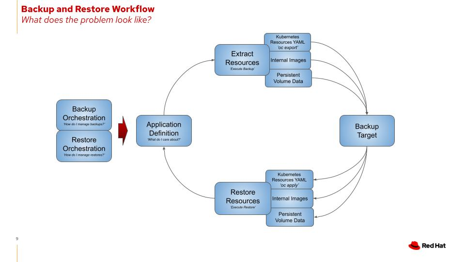
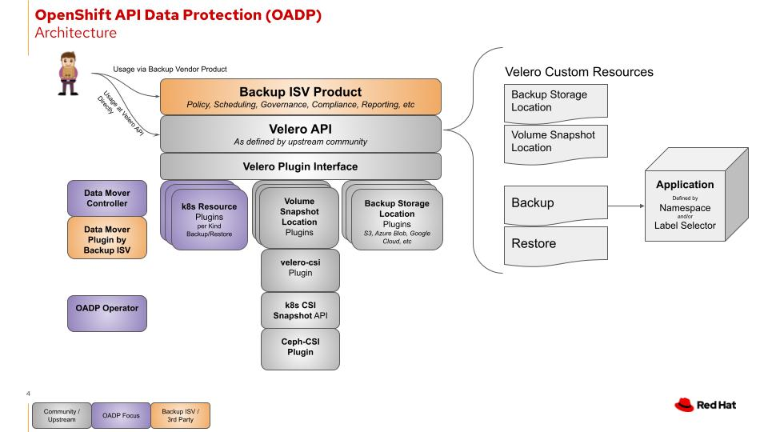
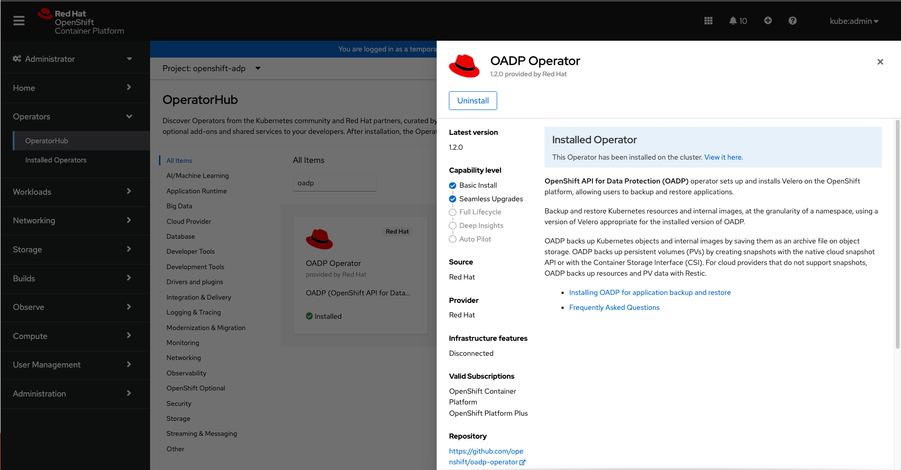

:sectlinks:
:markup-in-source: verbatim,attributes,quotes
:OCP4_PASSWORD: %ocp4_password%
:CLUSTER_ADMIN_USER: %cluster_admin_user%
:APPS_URL: %apps_url%
:API_URL: %api_url%
== Overview
The OpenShift API for Data Protection (OADP) is an Operator that helps you define and configure installation of https://velero.io/[Velero] and its required resources to run on OpenShift.

=== What problem is OADP attempting to solve?
OADP enables backup, restore, and disaster recovery of applications on an OpenShift cluster. Data that can be protected with OADP include k8s resource objects, persistent volumes, and internal images.


If you want to migrate data between clusters, please look into the https://access.redhat.com/documentation/en-us/openshift_container_platform/4.8/html/migration_toolkit_for_containers[Migration Toolkit for Containers project (MTC)].

=== Architecture


=== Requirements
* ObjectStorage - AWS or any S3 compatible object storage eg minio, GCP, and Azure. Other S3 compatible providers are available as an option with OpenShift Data Foundation which includes multicloud gateway for multicloud portability.
** Needed for backup and restore of kubernetes resources and internal images.

* `cluster-admin` role is required to use OADP. Non-admin usage is on the roadmap for future iterations.
** Cluster admin is used to add custom resource definitions for OADP and Velero resources.

=== Working with Velero
You can use velero CLI to perform most of the operations. They can be downloaded from https://github.com/vmware-tanzu/velero/releases/[Velero github page].
The velero CLI we have setup for you is an alias to a binary within the velero deployment on the cluster.

Inspect the alias:
[source,bash,role=execute]
----
alias velero
----

See available commands:
[source,bash,role=execute]
----
velero help
----

You can also configure velero via Kubernetes object json/yaml files using `oc` or `kubectl`. Click below for Velero API types references.

- https://velero.io/docs/v1.11/api-types/backup/[Backup]
- https://velero.io/docs/v1.11/api-types/restore/[Restore]
- https://velero.io/docs/v1.11/api-types/schedule/[Schedule]
- https://velero.io/docs/v1.11/api-types/backupstoragelocation/[BackupStorageLocation]
- https://velero.io/docs/v1.11/api-types/volumesnapshotlocation/[VolumeSnapshotLocation]

=== Velero Plugins
Velero supports the use of plugins to integrate with different storage systems, snapshot providers, and supporting backup and restore of additional types of resources.

For server installation, velero will require at least one object store plugin. Exception to this is if you will not be configuring a backup storage location.

There are mainly two categories of Velero plugins that can be specified while Velero:

- `defaultVeleroPlugins`
- `customVeleroPlugins`

There are several default OADP validated/provided Velero plugins that can be installed: 
`AWS`, `GCP`, `Azure`,`OpenShift`, `Kubevirt`,`CSI`, and `VSM`. For installation, 
you need to specify them in the `oadp_v1alpha1_dpa_cr.yaml` file 
during deployment.

```
apiVersion: oadp.openshift.io/v1alpha1
kind: DataProtectionApplication
metadata:
  name: dpa-sample
spec:
  configuration:
    velero:
      defaultPlugins:
      - azure
      - gcp
      - aws
      - openshift
```
The above specification will install Velero with four of the default plugins.

- `customVeleroPlugins`:
For installation of custom Velero plugins, you need to specify the plugin
`image` and plugin `name` in the `oadp_v1alpha1_dpa_cr.yaml` file during
deployment.

For instance,
```
apiVersion: oadp.openshift.io/v1alpha1
kind: DataProtectionApplication
metadata:
  name: dpa-sample
spec:
  configuration:
    velero:
      defaultPlugins:
      - azure
      - openshift
      customPlugins:
      - name: custom-plugin-example
        image: quay.io/example-repo/custom-velero-plugin
```
The above specification will install Velero with three plugins:
`azure`, `openshift`, and `custom-plugin-example`.

=== Provided APIs
OADP allows several https://velero.io/docs/v1.7/api-types/[Velero API types] to be configured and defined within a single Custom Resource YAML.
The most up to date API reference for OADP is located on the https://github.com/openshift/oadp-operator/blob/master/docs/API_ref.md[openshift/oadp-operator] repository

We are providing a copy below for convenience.

==== DataProtectionApplicationSpec

[width="100%",cols="11%,36%,53%",options="header",]
|===
|Property |Type |Description
|BackupLocations | [] https://pkg.go.dev/github.com/openshift/oadp-operator/api/v1alpha1#BackupLocation[BackupLocation] |Defines the list of configurations to use for `BackupStorageLocations`.

|SnapshotLocations | [] https://pkg.go.dev/github.com/openshift/oadp-operator/api/v1alpha1#SnapshotLocation[SnapshotLocation] |Defines the list of configurations to use for `VolumeSnapshotLocations`.

|UnsupportedOverrides |https://pkg.go.dev/github.com/openshift/oadp-operator/api/v1alpha1#UnsupportedImageKey[map [UnsupportedImageKey]string]
|Can be used to override the deployed dependent
images for development

|PodAnnotations |map [string] string |Used to add annotations to pods
deployed by operator

|PodDnsPolicy |https://pkg.go.dev/k8s.io/api/core/v1#DNSPolicy[corev1.DNSPolicy] |DNSPolicy defines how
a pod’s DNS will be configured.

|PodDnsConfig |https://pkg.go.dev/k8s.io/api/core/v1#PodDNSConfig[corev1.PodDNSConfig] |PodDNSConfig
defines the DNS parameters of a pod in addition to those generated from
DNSPolicy.

|BackupImages |*bool |BackupImages is used to specify whether you want
to deploy a registry for enabling backup and restore of images

|Configuration |https://pkg.go.dev/github.com/openshift/oadp-operator/api/v1alpha1#ApplicationConfig[*ApplicationConfig] |Configuration is used to configure
the data protection application’s server config.

|Features |https://pkg.go.dev/github.com/openshift/oadp-operator/api/v1alpha1#Features[*Features] |Define the configuration for the DPA to enable the Technology Preview features.
|===
https://pkg.go.dev/github.com/openshift/oadp-operator/api/v1alpha1#DataProtectionApplicationSpec[Complete schema definitions for the OADP API.]

==== BackupLocation

[width="100%",cols="6%,48%,46%",options="header",]
|===
|Property |Type |Description

|velero
|https://pkg.go.dev/github.com/vmware-tanzu/velero/pkg/apis/velero/v1#BackupStorageLocationSpec[*velero.BackupStorageLocationSpec]
|Location to store volume snapshots, as described in Backup Storage Location. For further details, see config/bsl_and_vsl.md[here].

|bucket
|https://pkg.go.dev/github.com/openshift/oadp-operator/api/v1alpha1#CloudStorage[*CloudStorageLocation]
|[Technology Preview] Automates creation of a bucket at some cloud storage providers for use as a backup storage location.  For further details, see https://access.redhat.com/support/offerings/techpreview[here].
|===
https://pkg.go.dev/github.com/openshift/oadp-operator/api/v1alpha1#BackupLocation[Complete schema definitions for the type `BackupLocation`.]

====  SnapshotLocation
[width="100%",cols="6%,48%,46%",options="header",]
|===
|Property |Type |Description
|velero
|https://velero.io/docs/v1.6/api-types/volumesnapshotlocation/[*VolumeSnapshotLocationSpec]
|Location to store volume snapshots, as described in Volume Snapshot Location. For further details, see [here] (
config/bsl_and_vsl.md).
|===
https://pkg.go.dev/github.com/openshift/oadp-operator/api/v1alpha1#SnapshotLocation[Complete schema definitions for the type `SnapshotLocation`.]

==== ApplicationConfig (DataProtectionApplicationSpec.Configuration)

[cols=",,",options="header",]
|===
|Property |Type |Description
|velero |*VeleroConfig |Defines the configuration for the Velero server.

|restic |*resticConfig |Defines the configuration for the Restic server.
|===
https://pkg.go.dev/github.com/openshift/oadp-operator/api/v1alpha1#ApplicationConfig[Complete schema definitions for the type `ApplicationConfig`.]

==== VeleroConfig

[width="100%",cols="11%,8%,81%",options="header",]
|===
|Property |Type |Description
|featureFlags |[] string |Defines the list of features to enable for the Velero instance.

|defaultPlugins |[] string |The following types of default Velero plugins can be installed: `aws`,`azure`, `csi`, `gcp`, `kubevirt`, `openshift`, and `vsm`.

|customPlugins |map [string]interface\{} |Used for installation of
custom Velero plugins. See [here] ( config/plugins.md) for further
information.

|restoreResourcesVersionPriority |string |Represents a configmap that will be created if defined for use in
conjunction with `EnableAPIGroupVersions` feature flag. Defining this
field automatically addS `EnableAPIGroupVersions` to the velero server
feature flag

|noDefaultBackupLocation |bool |To install Velero without a default backup storage location, you must set the noDefaultBackupLocation flag in order to confirm installation.

|podConfig |*PodConfig |Defines the configuration of the Velero pod.

|logLevel |string |Velero server’s log level (use debug for the most granular logging, leave unset for Velero default). Valid options are `trace`, `debug`, `info`, `warning`, `error`, `fatal`, and `panic`.
|===
https://pkg.go.dev/github.com/openshift/oadp-operator/api/v1alpha1#VeleroConfig[Complete schema definitions for the type `VeleroConfig`.]

==== CustomPlugin

[width="100%",cols="19%,11%,70%",options="header",]
|===
|Property |Type |Description
|name |string |Name of custom plugin.
|image |string |Image of custom plugin.
|===
https://pkg.go.dev/github.com/openshift/oadp-operator/api/v1alpha1#CustomPlugin[Complete schema definitions for the type `CustomPlugin`.]

==== ResticConfig

[width="100%",cols="19%,11%,70%",options="header",]
|===
|Property |Type |Description
|enable |*bool |If set to `true`, enables backup and restore using Restic. If set to `false`, snapshots are needed.

|supplementalGroups |[]int64 |Defines the linux
groups to be applied to the Restic Pod.

|timeout |string |Timeout defines the Restic timeout, default value is
1h

|PodConfig |*PodConfig |Defines the configuration of the Restic pod.
|===
https://pkg.go.dev/github.com/openshift/oadp-operator/api/v1alpha1#ResticConfig[Complete schema definitions for the type `ResticConfig`.]

==== PodConfig

[width="100%",cols="9%,36%,55%",options="header",]
|===
|Property |Type |Description
|nodeSelector |map [ string ] string |Defines the nodeSelector to be supplied to a `Velero podSpec` or a `Restic podSpec`.

|tolerations |https://pkg.go.dev/k8s.io/api/core/v1#Toleration[[]corev1.Toleration] |Defines the list of tolerations to be applied
to a Velero Deployment/Restic daemonset.

|resourceAllocations
|https://pkg.go.dev/k8s.io/api/core/v1#ResourceRequirements[corev1.ResourceRequirements]
|Set specific resource `limits` and `requests` for the Velero/Restic
pods as described in Setting Velero CPU and memory resource allocations. For more information, go [here] (config/resource_req_limits.md).

|labels |map[string] string | Labels to add to pods.
|===
https://pkg.go.dev/github.com/openshift/oadp-operator/api/v1alpha1#PodConfig[Complete schema definitions for the type `PodConfig`.]

==== Features

[width="100%",cols="9%,36%,55%",options="header",]
|===
|Property |Type |Description
|dataMover |*DataMover | Defines the configuration of the Data Mover.
|===
https://pkg.go.dev/github.com/openshift/oadp-operator/api/v1alpha1#Features[Complete schema definitions for the type `Features`.]

==== DataMover

[width="100%",cols="9%,36%,55%",options="header",]
|===
|Property |Type |Description
|enable |*bool |If set to `true`, deploys the volume snapshot mover controller and a modified CSI Data Mover plugin. If set to `false`, these are not deployed.
|credentialName |string |User-supplied Restic `Secret` name for Data Mover.
|timeout |string |A user-supplied duration string for `VolumeSnapshotBackup` and `VolumeSnapshotRestore` to complete. Default is 10m (10 minutes).
|===

See also
https://pkg.go.dev/github.com/openshift/oadp-operator[image:https://pkg.go.dev/badge/github.com/openshift/oadp-operator.svg[Go
Reference]] for a deeper dive.

=== Installing OADP
OADP is available to be installed via OperatorHub, but we have already set it up for you in this lab.

_Screenshot of OADP Operator in OperatorHub_

DataProtectionApplication is a custom resource that is used to define the desired configuration which OADP Operator uses to deploy Velero, Restic and other components.

Look at OADP DataProtectionApplication Custom Resource Custom Resource configuration we have setup for you
[source,bash,role=execute]
----
oc get dpa -n openshift-adp -o yaml
----

Note that the enabled supported plugins specified under `spec.configuration.velero.defaultPlugins` are

- openshift: Also known as openshift-velero-plugin, this plugin enables backup and restore of OpenShift resources such but not limited to DeploymentConfigs, ImageStreams, and BuildConfigs.
- aws: Also known as velero-plugin-for-aws, this plugin enables backup and restore using AWS S3 or S3 other compatible providers as object storage and AWS EBS for snapshotting volumes.
- csi: Also known as velero-plugin-for-csi, this plugin enables backup and restore of CSI volumes using CSI drivers for snapshotting volumes.

Also note the feature flags specified under `spec.configuration.velero.featureFlags` are

- EnableCSI: a required flag to enable CSI support

The object storage we are using is an S3 compatible storage provided by OpenShift Storage with local endpoint at `http://s3.openshift-storage.svc/`. We are relying on the aws plugin to access this local endpoint specifying custom s3Url. The bucket name is `migstorage`, the prefix `velero` is the directory used to segregate the velero backup and restore from root of object storage.

The snapshot locations enabled for storing volume snapshots are aws ebs.

Verify OADP resources are ready
[source,bash,role=execute]
----
oc get deployments -n openshift-adp
----
