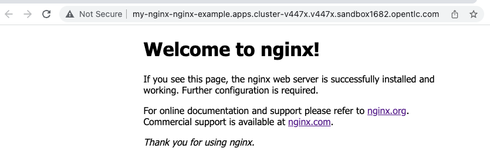

:sectlinks:
:markup-in-source: verbatim,attributes,quotes
:OCP4_PASSWORD: %ocp4_password%
:CLUSTER_ADMIN_USER: %cluster_admin_user%
:CLUSTER_ADMIN_PASSWORD: %cluster_admin_password%
:APPS_URL: %apps_url%
:API_URL: %api_url%

== Backing up nginx Stateless application

We are going to protect a simple nginx-stateless application. This application has already been deployed on your OCP 4 cluster in the `nginx-example` namespace. In the terminal of our source OCP 4 cluster, we can observe the running status of the app.
[source,bash,role=execute]
----
oc get pods -n nginx-example
----

[source,subs="{markup-in-source}"]
--------------------------------------------------------------------------------
NAME                                READY   STATUS    RESTARTS   AGE
nginx-deployment-56b7785cc7-vd76k   1/1     Running   0          40m
nginx-deployment-56b7785cc7-z8kg7   1/1     Running   0          40m
--------------------------------------------------------------------------------

Let's obtain the route to the application and access the web UI.
[source,bash,role=execute]
----
oc get route -n nginx-example
----
NOTE: You can also click http://my-nginx-nginx-example.{APPS_URL}[here] to open the application.

[source,subs="{markup-in-source}"]
--------------------------------------------------------------------------------
NAME       HOST/PORT                           PATH   SERVICES   PORT   TERMINATION   WILDCARD
my-nginx   my-nginx-nginx-example.{APPS_URL}          my-nginx   8080                 None
--------------------------------------------------------------------------------

Let's proceed and save all application resources in `nginx-running-before.txt` before creating the backup. We will utilize this text file later in the process to compare the resources after the restore.
[source,bash,role=execute]
----
oc get all -n nginx-example > nginx-running-before.txt
----

=== Using Velero to backup application namespace

Let's create a backup of the `nginx-example` namespace.
[source,bash,role=execute-2]
----
velero backup create nginx-backup --include-namespaces nginx-example
----

You can monitor the progress of the backup by executing the following command.
[source,bash,role=execute]
----
velero backup describe nginx-backup
----

When the backup `Phase:` is `Completed`, proceed to next section.
[source,bash,role=execute]
----
velero backup describe nginx-backup | grep Phase:
----

=== Viewing backup content in S3 storage

Backup content is stored in S3 storage in the specified content in the prefix location under folder backup inside the backup name's folder.

`<bucket>/<velero-prefix>/backups/<backup-name>/<backup-content>`

NOTE: awsocs is an alias of `awsocs='aws --endpoint-url http://s3.openshift-storage.svc'`
[source,bash,role=execute]
----
awsocs s3 ls migstorage/velero/backups/nginx-backup/
----
Content on these files are explained in https://velero.io/docs/v1.7/output-file-format/[Velero Docs].

=== Simulate a disaster

When the backup `Phase:` is `Completed`, we'll proceed to simulate a disaster by deleting the namespace.
[source,bash,role=execute]
----
oc delete ns nginx-example
----

Check that the application is no longer available.

NOTE: Click http://my-nginx-nginx-example.{APPS_URL}[here] to open the application.

When application is no longer available, proceed to next section.

=== Restore deleted application

We can restore the previously deleted applications using the backup we created.
[source,bash,role=execute]
----
velero restore create nginx-restore --from-backup nginx-backup
----

We can monitor the progress of the restore by executing the following command. The restore process is considered complete when the `Phase` field displays `Completed`.
[source,bash,role=execute]
----
velero restore describe nginx-restore && velero restore describe nginx-restore | grep Phase:
----

Wait until pods become available.
[source,bash,role=execute]
----
oc get pods -n nginx-example
----

[source,subs="{markup-in-source}"]
--------------------------------------------------------------------------------
NAME                                READY   STATUS    RESTARTS   AGE
nginx-deployment-56b7785cc7-g8xfj   1/1     Running   0          47s
nginx-deployment-56b7785cc7-q824n   1/1     Running   0          47s
--------------------------------------------------------------------------------

Verify webUI is available in the restored application.

NOTE: Click http://my-nginx-nginx-example.{APPS_URL}[here] to open the application.

Let's proceed and gather the restored nginx application resources in the `nginx-running-after.txt` file once the restore process reaches the `Completed` phase.
[source,bash,role=execute]
----
oc get all -n nginx-example > nginx-running-after.txt
----

Compare `nginx-running-before.txt` and `nginx-running-after.txt` and verify resources.