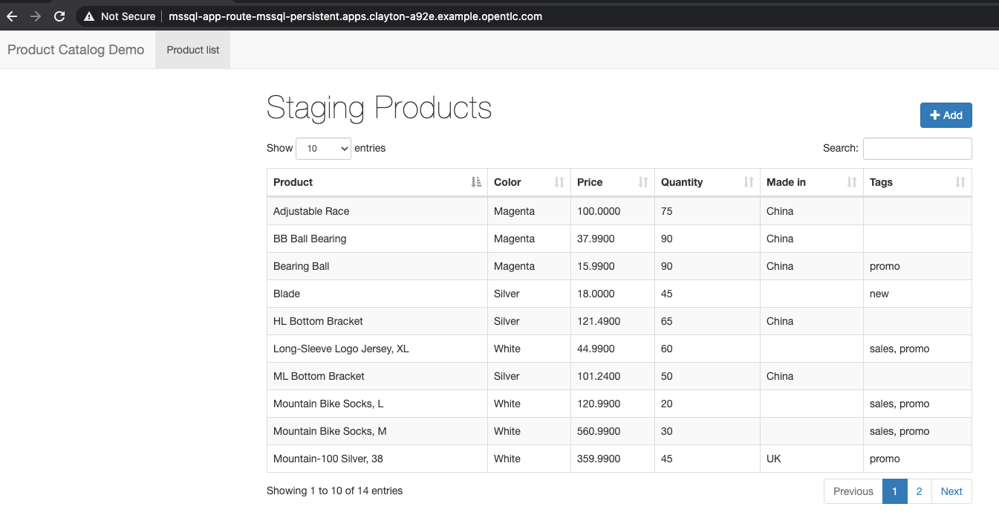
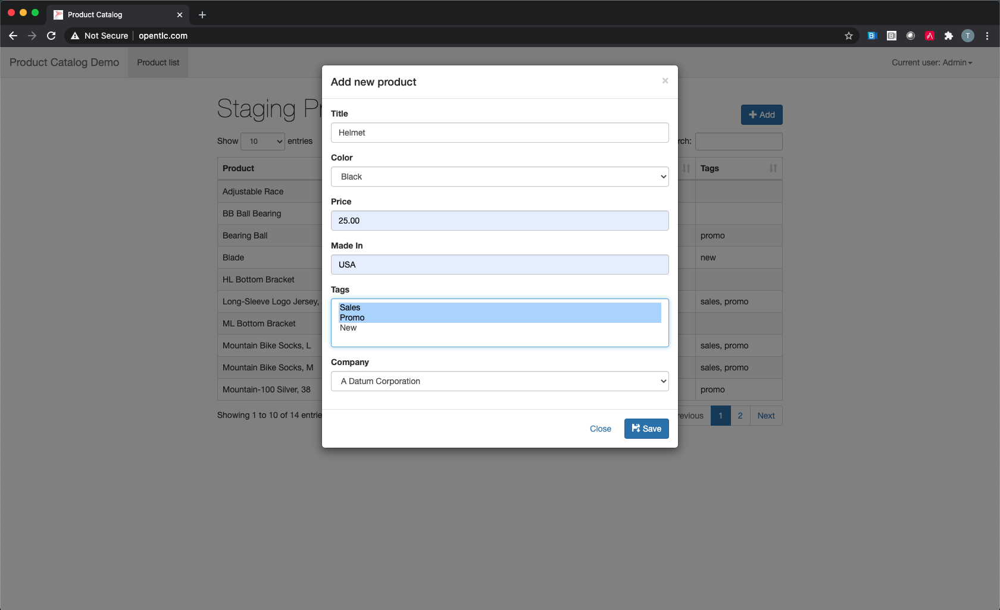
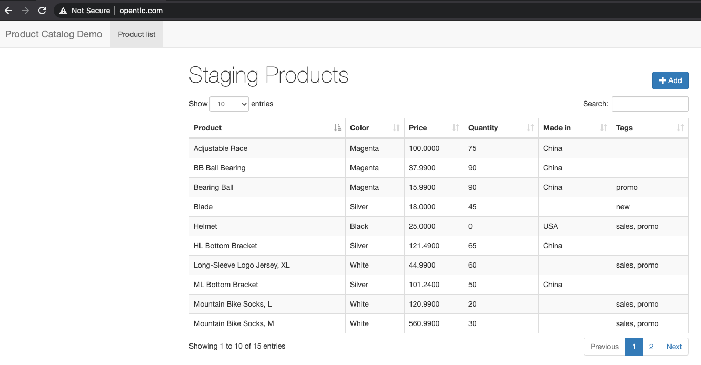

:sectlinks:
:markup-in-source: verbatim,attributes,quotes
:OCP4_GUID: %ocp4_guid%
:OCP4_DOMAIN: %ocp4_domain%
:OCP4_SSH_USER: %ocp4_ssh_user%
:OCP4_PASSWORD: %ocp4_password%

== Backing up single namespace

We are going to protecting a simple Product Inventory web-based application front-end, backed by Microsoft SQL Server. This application has been pre-deployed on your OCP 4 cluster in the `mssql-persistent` namespace, using a single PV backed by NFS for persistent storage.

In our source OCP 4 cluster terminal, we can see the app running:

[source,bash,role=execute]
----
oc get pods -n mssql-persistent
----

[source,subs="{markup-in-source}"]
--------------------------------------------------------------------------------
NAME                                    READY   STATUS    RESTARTS   AGE
mssql-app-deployment-6ffb46c5d6-n5fvv   1/1     Running   0          41m
mssql-deployment-1-xq4p4                1/1     Running   0          41m
--------------------------------------------------------------------------------

Let’s get the route to the application, and bring up the webUI.

[source,bash,role=execute]
----
oc get route -n mssql-persistent
----
NOTE: You can also click http://mssql-app-route-mssql-persistent.apps.cluster-{OCP4_GUID}.{OCP4_GUID}.{OCP4_DOMAIN}[here] to open the application.

[source,subs="{markup-in-source}"]
--------------------------------------------------------------------------------
NAME              HOST/PORT                                                       PATH   SERVICES     PORT   TERMINATION   WILDCARD
mssql-app-route   mssql-app-route-mssql-persistent.apps.cluster-{OCP4_GUID}.{OCP4_GUID}.{OCP4_DOMAIN}         mssql-app-service   5000                 None
--------------------------------------------------------------------------------

Let’s go ahead and add a new product to the inventory. Click on the +Add button and enter some data.

You can see the application is functioning and state is being saved in the DB.

=== Using Velero to backup application namespace

Let’s go ahead and create a backup of `mssql-persistent` namespace.
[source,bash,role=execute-2]
----
velero backup create mssql-backup --include-namespaces mssql-persistent -n openshift-adp
----

You can check on the backup progress by running the following
[source,bash,role=execute]
----
velero backup describe mssql-backup -n openshift-adp
----
When the backup is finished, proceed to next section.

=== Simulate a disaster
When the backup is finished, we'll proceed to simulate a disaster by deleting the namespace.
[source,bash,role=execute]
----
oc delete ns mssql-persistent
----

Check that the application is no longer available.
NOTE: Click http://mssql-app-route-mssql-persistent.apps.cluster-{OCP4_GUID}.{OCP4_GUID}.{OCP4_DOMAIN}[here] to open the application.

When application is no longer available, proceed to next section.

=== Restoring deleted application
We can restore applications deleted earlier by restoring from the backup we created.
[source,bash,role=execute]
----
velero restore create mssql-restore --from-backup mssql-backup -n openshift-adp
----

[source,bash,role=execute]
----
velero restore describe mssql-restore -n openshift-adp
----

Wait until pods become available.
[source,bash,role=execute]
----
oc get pods -n mssql-persistent
----

[source,subs="{markup-in-source}"]
--------------------------------------------------------------------------------
NAME                                    READY   STATUS    RESTARTS   AGE
mssql-app-deployment-6ffb46c5d6-n5fvv   1/1     Running   0          41m
mssql-deployment-1-xq4p4                1/1     Running   0          41m
--------------------------------------------------------------------------------

Verify that the data you added earlier persisted in the restored application.

NOTE: Click http://mssql-app-route-mssql-persistent.apps.cluster-{OCP4_GUID}.{OCP4_GUID}.{OCP4_DOMAIN}[here] to open the application.
