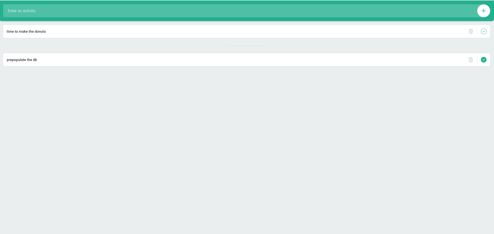
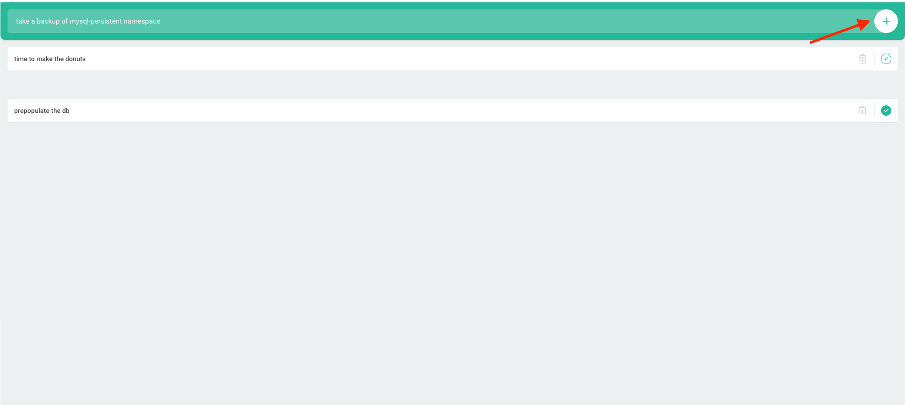
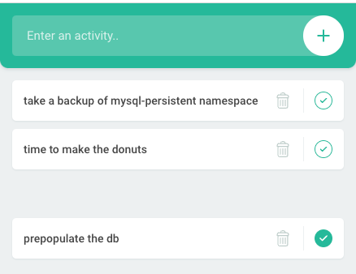

:sectlinks:
:markup-in-source: verbatim,attributes,quotes
:OCP4_PASSWORD: %ocp4_password%
:CLUSTER_ADMIN_USER: %cluster_admin_user%
:CLUSTER_ADMIN_PASSWORD: %cluster_admin_password%
:APPS_URL: %apps_url%
:API_URL: %api_url%

== Backing up single namespace - CSI Volume Snapshotting

Velero offers several options for backing up persistent volumes. Initially, the available capabilities were to use https://github.com/restic/restic[restic] or utilize the native volume snapshot feature provided by cloud providers. However, Velero has expanded its capabilities and now supports the Container Storage Interface (CSI) for backing up persistent volumes.
CSI is an interface introduced to Kubernetes to facilitate compatibility with various storage solutions. You can leverage the CSI interface with any cloud provider that has implemented it.

As CSI is the preferred interface in Kubernetes, this lab has been designed to use CSI for storage.

We will be protecting a Todo List web-based application front-end that is backed by MariaDB Server. This application has already been deployed on your OCP 4 cluster in the `mysql-persistent` namespace. In the terminal of our source OCP 4 cluster, we can observe the application running.
[source,bash,role=execute]
----
oc get pods -n mysql-persistent
----

[source,subs="{markup-in-source}"]
--------------------------------------------------------------------------------
NAME                     READY   STATUS      RESTARTS   AGE
mysql-5f55cd786d-cvgc6   1/1     Running     0          75s
todolist-1-6f7sl         1/1     Running     0          71s
todolist-1-deploy        0/1     Completed   0          75s
--------------------------------------------------------------------------------

Let's obtain the route to the application and access the web UI.
[source,bash,role=execute]
----
oc get route -n mysql-persistent
----
NOTE: You can also click http://todolist-route-mysql-persistent.{APPS_URL}[here] to open the application.

[source,subs="{markup-in-source}"]
--------------------------------------------------------------------------------
NAME             HOST/PORT                                         PATH   SERVICES   PORT    TERMINATION   WILDCARD
todolist-route   todolist-route-mysql-persistent.{APPS_URL}        /      todolist   <all>                 None
--------------------------------------------------------------------------------

Let’s add a new activity to the todo-list. Click on the (+) `Add button` on the upper right corner to enter some data.

You can see the application is functioning and activity is being saved in the DB.

=== About Velero CSI Snapshot and Prerequisites
In order to use CSI with velero, feature flag `EnableCSI` and plugin `csi` is required. It is specified in our DataProtectionApplication Custom Resource.

You can look at the velero configuration by running the following command:
[source,bash,role=execute]
----
oc get dpa example-dpa -n openshift-adp -o=jsonpath="{.spec.configuration.velero}" && echo
----
Aside from enabling CSI from Velero side, the volume that is going to be backed up must be using a CSI driver. A VolumeSnapshotClass object is also needed and has to specify the CSI driver along with the following label `velero.io/csi-volumesnapshot-class: 'true'`.

See the storage class used by the application in the following command:
[source,bash,role=execute]
----
oc get pvc -n mysql-persistent
----

This storage class has provisioner `ebs.csi.aws.com`
[source,bash,role=execute]
----
oc get storageclass gp2-csi
----

which is one of the CSI driver installed on the system
[source,bash,role=execute]
----
oc get csidrivers
----

We have added `velero.io/csi-volumesnapshot-class: 'true'` label to a VolumeSnapshotClass object for the `ebs.csi.aws.com` driver which were used by the application we had just backed up.
[source,bash,role=execute]
----
oc get VolumeSnapshotClass oadp-example-snapclass -ojsonpath='{.metadata.labels}' && echo
----

Since the persistent volume specified in the backup is using a CSI driver with the given label, a VolumeSnapshot will be taken.

NOTE: The CSI snapshot is ephemeral, so VolumeSnapshot is immidiatly deleted after backup marks complete. 

You can view VolumeSnapshot till the backup is `InProgress` stage. So, let's monitor the VolumeSnapshot in the application namespace before starting the backup. 
[source,bash,role=execute-2]
----
 watch oc get volumesnapshot -n mysql-persistent 
----

=== Backup application namespace using Velero CLI

In the previous example, we used the Velero CLI, which does not support advanced settings. Therefore, let's create a backup of the `mysql-persistent` namespace via an instance of the backup CRD.
[source,yaml]
----
apiVersion: velero.io/v1
kind: Backup
metadata:
  name: mysql-backup
  namespace: openshift-adp
spec:
  includedNamespaces:
  - mysql-persistent
  ttl: 720h0m0s
----

Let's copy the above code block to mysql-backup.yaml and create a backup.
[source,bash,role=execute]
----
cat << EOF > mysql-backup.yaml
apiVersion: velero.io/v1
kind: Backup
metadata:
  name: mysql-backup
  namespace: openshift-adp
spec:
  includedNamespaces:
  - mysql-persistent
  ttl: 720h0m0s
EOF
oc apply -f mysql-backup.yaml
----

You can monitor the progress of the backup by executing the following command.
[source,bash,role=execute]
----
velero backup describe mysql-backup
----

When the backup `Phase:` is `Completed`, proceed to the next section.
[source,bash,role=execute]
----
velero backup describe mysql-backup | grep Phase:
----

=== Viewing backup content in S3 storage
Backup content is stored in S3 storage in the specified content in the prefix location under folder backup inside the backup name's folder.

`<bucket>/<velero-prefix>/backups/<backup-name>/<backup-content>`

Note: awsocs is an alias of `awsocs='aws --endpoint-url http://s3.openshift-storage.svc'`
[source,bash,role=execute]
----
awsocs s3 ls migstorage/velero/backups/mysql-backup/
----

Content on these files are explained in https://velero.io/docs/v1.7/output-file-format/[Velero Docs].

View VolumeSnapshotContent created that represents the VolumeSnapshot.
[source,bash,role=execute]
----
oc get volumesnapshotcontent
----

CSI Snapshot is local to the cluster. However, a DataMover capability in exercise 7.0 will allow snapshot moving to an external location.

 The Volumesnapshots created by the plugin will be retained only for the duration of the backup's lifetime, regardless of whether the DeletionPolicy on the volumeSnapshotclass is set to Retain. To achieve this, prior to deleting the VolumeSnapshot during the backup deletion process, the volumeSnapshotcontent object will be patched to set its DeletionPolicy to Delete. As a result, deleting the volumeSnapshot object will trigger a cascade delete of the volumeSnapshotcontent and the corresponding snapshot in the storage provider.

For more information about how CSI plugin works, see https://velero.io/docs/v1.7/csi/#how-it-works---overview[Velero Docs].

We have set the DeletionPolicy to Retain on the VolumeSnapshotClass to preserve the VolumeSnapshot in the storage system throughout the lifetime of the Velero backup. This setting prevents the deletion of the VolumeSnapshot from the storage system, even in the event of a disaster where the namespace with the VolumeSnapshot object may be lost. In the next section, we will attempt to create this disaster scenario.

=== Simulate a disaster
When the backup `Phase:` is `Completed`, we'll proceed to simulate a disaster by deleting the namespace.
[source,bash,role=execute]
----
oc delete ns mysql-persistent
----

Check that the application is no longer available.

NOTE: Click http://todolist-route-mysql-persistent.{APPS_URL}[here] to open the application.

When application is no longer available, proceed to next section.

=== Restoring deleted application
We can restore applications deleted earlier by restoring from the backup we created.
[source,bash,role=execute]
----
cat << EOF > mysql-restore.yaml
apiVersion: velero.io/v1
kind: Restore
metadata:
  name: mysql-restore
  namespace: openshift-adp
spec:
  backupName: mysql-backup
  restorePVs: true
EOF
oc apply -f mysql-restore.yaml
----

We can check when the restore is completed by running the following. The restore is complete when `Phase:` is `Completed`.
[source,bash,role=execute]
----
velero restore describe mysql-restore && velero restore describe mysql-restore | grep Phase:
----

Wait until pods become available.
[source,bash,role=execute]
----
oc get pods -n mysql-persistent
----

[source,subs="{markup-in-source}"]
--------------------------------------------------------------------------------
NAME                     READY   STATUS      RESTARTS   AGE
mysql-5f55cd786d-pshzl   1/1     Running     0          4m6s
todolist-1-deploy        0/1     Completed   0          4m5s
todolist-1-jx9xb         1/1     Running     0          4m1s
--------------------------------------------------------------------------------

Verify that the data you added earlier persisted in the restored application.

NOTE: Click http://todolist-route-mysql-persistent.{APPS_URL}[here] to open the application.
