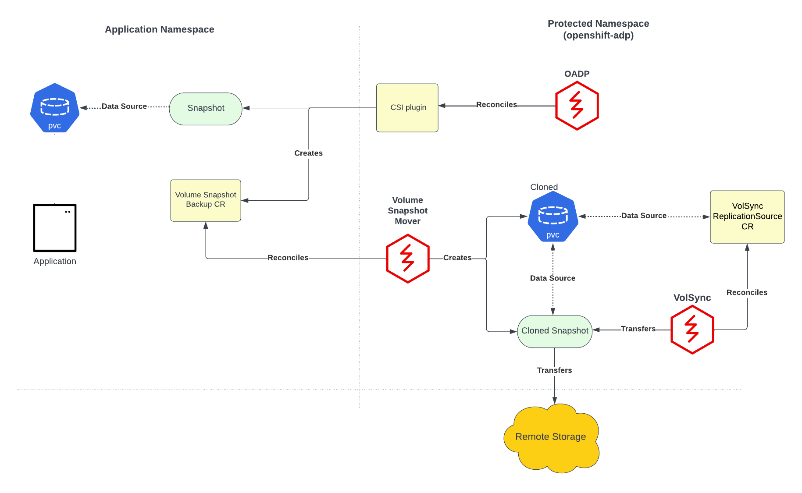
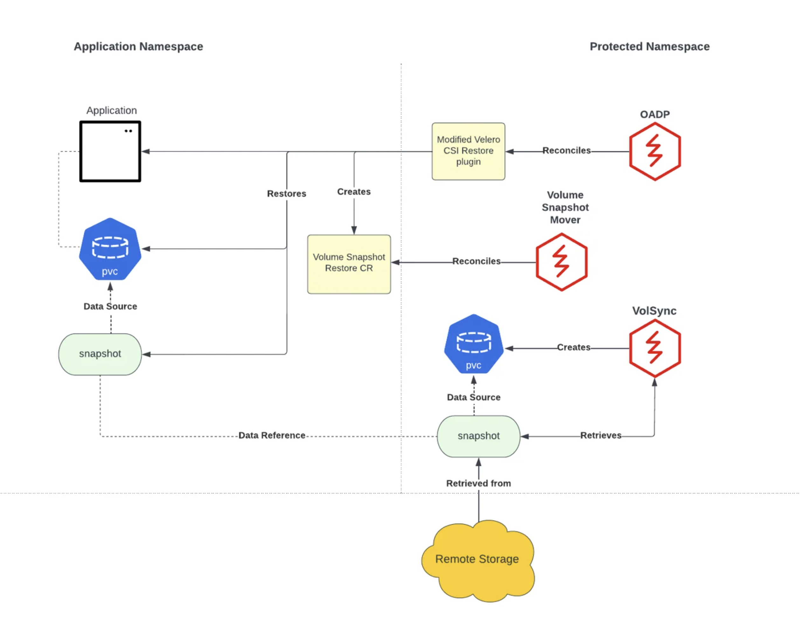

:sectlinks:
:markup-in-source: verbatim,attributes,quotes
:OCP4_PASSWORD: %ocp4_password%
:CLUSTER_ADMIN_USER: %cluster_admin_user%
:CLUSTER_ADMIN_PASSWORD: %cluster_admin_password%
:APPS_URL: %apps_url%
:API_URL: %api_url%

== Backing up multiple volumes using VolumeSnapshotMover

In previous exercises, we backed up applications using CSI, or Container Storage Interface.CSI volumes are now the industry standard and are the storage backing for most Cloud Native applications. However, issues concerning CSI volumes still remain. Some volumes have vendor-specific requirements, and can prevent proper portability and durability. VolumeSnapshotMover works to solve this case. 

During a backup using Velero with CSI, CSI snapshotting is performed. This snapshot is created on the storage provider where the snapshot was taken. This means that for some providers, such as ODF, the snapshot lives on the cluster. Due to this poor durability, in the case of a disaster scenario, the snapshot is also subjected to disaster.

With volumeSnapshotMover, snapshots are relocated off of the cluster to the targeted backupStorageLocation (generally object storage), providing additional safety.

=== Prerequisites
Lets check the required components to perform the backup restore using VolumeSnapshotMover

VolSync is a Kubernetes operator that performs asynchronous replication of persistent volumes within, or across, clusters. The replication provided by VolSync is independent of the storage system. This allows replication to and from storage types that don’t normally support remote replication. We will be using Volsync’s restic datamover.
Volsync pre-deployed on your OCP 4 cluster in the `openshift-operators` namespace. Verify pre-deployed Volsync resources, 
[source,bash,role=execute]
----
oc get deployments -n openshift-operators
----

VolumeSnapshotMover(VSM) controller is the CSI data mover orchestrator, it is deployed via the OADP Operator once the datamover feature is enabled. 

Let's update DataProtectionApplication to enable datamover feature flag to true.
[source,bash,role=execute]
----
oc -n openshift-adp patch --type='json' dpa example-dpa -p '[{"op": "add", "path": "/spec/features/dataMover/enable", "value": true}]'
----

Let's add VSM as velero 'defualtPlugin'
[source,bash,role=execute]
----
oc -n openshift-adp patch --type='json' dpa example-dpa -p '[{"op": "add", "path": "/spec/configuration/velero/defaultPlugins/-", "value": 'vsm'}]'
----

CSI and VSM as velero 'defaultPlugins' is required to perform backup.
Let's verify our changes
[source,bash,role=execute]
----
oc get dpa example-dpa -n openshift-adp -o=jsonpath="{.spec.configuration.velero}"
----

In this exercise, we will backup namespace 'minimal-3csivol' using VolumeSnapshotMover. 
In our source OCP 4 cluster terminal, we can see the app running:
[source,bash,role=execute]
----
oc get pods -n minimal-3csivol
----
[source,subs="{markup-in-source}"]
--------------------------------------------------------------------------------
NAME                               READY   STATUS    RESTARTS   AGE
minimal-3csivol-59f59dd6fc-xcd9r   1/1     Running   0          18h
--------------------------------------------------------------------------------

Simialar to the namespace, this application has 3 persistent volume claims (PVC)
[source,bash,role=execute]
----
oc get pvc -n minimal-3csivol
----
[source,subs="{markup-in-source}"]
--------------------------------------------------------------------------------
NAME      STATUS   VOLUME                                     CAPACITY   ACCESS MODES   STORAGECLASS   AGE
volume1   Bound    pvc-ab57fef6-3f31-4e6f-8c90-a0cac80d9950   1Gi        RWO            gp2-csi        18h
volume2   Bound    pvc-2e845c79-03ac-4765-9bcd-94429c6090ac   1Gi        RWO            gp2-csi        18h
volume3   Bound    pvc-c6d2a43a-b6f2-4cf0-9cbb-20aee29e19e3   1Gi        RWO            gp2-csi        18h
--------------------------------------------------------------------------------

=== Backup three volumes using volumesnapShotMover 

The M-CSI plugin is extended to facilitate the data movement of CSI VolumeSnapshots(VS) from cluster to object storage.

[source,bash,role=execute]
----
velero backup create minimal-3csivol-1 --include-namespaces minimal-3csivol
----
You can check on the backup progress by running the following
[source,bash,role=execute]
----
velero backup describe minimal-3csivol-1
----

When the Velero Backup is triggered, the M-CSI plugin creates a VS for each PersistentVolumeClaim (PVC) to be backed up.
Now for the created VS, the M-CSI plugin fetches the associated VolumeSnapshotContent (VSC) and adds it as an additional item to be backed up.

In this case, we have three pvc, therefore; three volumesnapShots(VS) and three associated VolumeSnapshotContents(VSC)
[source,bash,role=execute]
----
oc get vsc --sort-by=.metadata.creationTimestamp | tail -n 3
----

Subsequently, the M-CSI plugin then checks whether there is a VolumeSnapshotBackup (VSB) instance associated with the VSC that was added as an additional item, if there isn't one then the M-CSI plugin creates a VSB for each VSC.
[source,bash,role=execute]
----
oc get vsb -n minimal-3csivol  --sort-by=.metadata.creationTimestamp  | tail -n 3
----

The creation of a VSB triggers the data movement process as the VolumeSnapshotMover (VSM) controller begins to reconcile on this VSB instance.
VSM first validates the VSB, then copies the VSC, followed by VS and finally the PVC into the namespace where OADP Operator resides. Once this is done the VSM controller uses the PVC as a datasource and creates a Volsync ReplicationSource CR.
Volsync reconciles on ReplicationSource CR and then Volsync’s restic mover begins the transfer of data from cluster to the target object storage.

Since the time when VSB is created and data movement is started, Velero backup waits for Volsync to complete the data movement, once that's done VSB is marked complete.
Let's check the latest vsb's status phase
[source,bash,role=execute]
----
LATEST_VSB=$(oc get vsb -n minimal-3csivol  --sort-by=.metadata.creationTimestamp -o name | tail -n 1)
oc get $LATEST_VSB -n minimal-3csivol -ojsonpath="{.status.phase}"
----

Consequently the backup is marked complete by Velero.
[source,bash,role=execute]
----
velero backup describe minimal-3csivol-1 | grep Phase:
----

When the backup `Phase:` is `Completed`., proceed to next section.

One point to note is that, VSM controller deletes all the extraneous resources that were created during the data mover backup process.

Visual discription of the steps we performed. For more information please checkout https://cloud.redhat.com/blog/a-technical-overview-of-volumesnapshotmover[A Technical Overview of VolumeSnapshotMover]

=== Simulate a disaster
[source,bash,role=execute]
----
oc delete ns minimal-3csivol
----
When application is no longer available, proceed to next section.

=== Backup deleted application

We can restore applications deleted earlier by restoring from the backup we created.
[source,bash,role=execute]
----
velero restore create minimal-3csivol-restore-1 --from-backup minimal-3csivol-1
----

As mentioned previously, during backup, a VSB custom resource is stored as a backup object. This CR contains details pertinent to performing a volumeSnapshotMover restore.

Once a VSB CR is encountered, a VSR CR is created by the M-CSI plugin. The VSM controller then begins to reconcile on the VSR CR.
[source,bash,role=execute]
----
oc get vsr -n minimal-3csivol  --sort-by=.metadata.creationTimestamp  | tail -n 3
----

Here, a VolSync ReplicationDestination is created by the VSM controller in the OADP Operator namespace. This CR will recover the VolumeSnapshot that was stored in the object storage location during backup.

After the VolSync restore step completes, the Velero restore continues as usual. However, the M-CSI plugin uses the VolSync VolumeSnapshot's snapHandle as the data source for its associated PVC. 

The stateful application data is then restored, and disaster is averted.

Visual discription of the steps we performed. 
